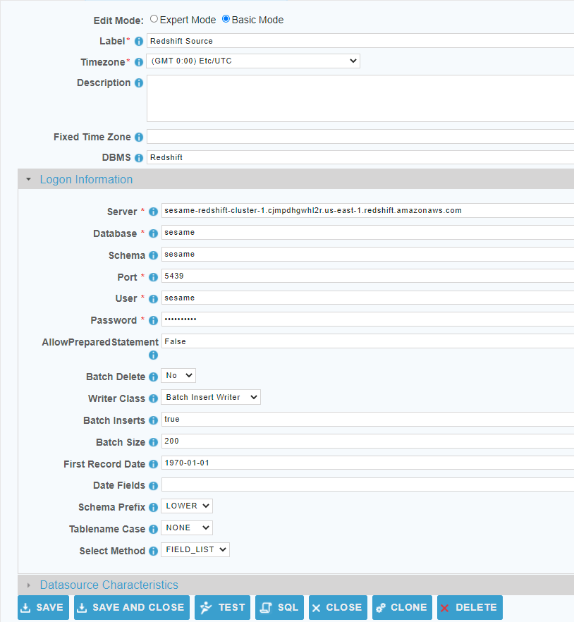

 <a href="http://www.sesamesoftware.com"></img></a>

[comment]: # (Change Heading to reflect Datasource)

#  Amazon Redshift

[comment]: # (Leave Nav BAR untouched)

[[Installation](../guides/installguide.md)] [[Registration](../guides/RegistrationGuide.md)] [[Configuration](../guides/configurationGuide.md)] [[Datasource](../guides/DatasourceGuide.md)]

---

[comment]: # (Leave Or Alter Required info as needed)

### *Required Information*

* **Server**
* **Database**
* **Schema**
* **Port**
* **User Name**
* **Password**
* **Schema Prefix**
* **Tablename Case**

### Steps

[comment]: # (step 1 is common to all  Datasources)
[comment]: # (Step 2.1and 2.2 should be adjusted for Data Source specific)
[comment]: # (Step 3 should be Image of the datasource you can add the screenshot to the images folder or create a placeholder like {image of datasource screen})
[comment]: # (adjust step 4 and below as needed)

1. From the front page of the RJ UI, go to the left hand side and click **Datasources --> New Datasource**
2. On the next screen, choose a label for your Datasource.
   1. Recommended: ‘Redshift Target’ or something similar.
   2. Select Redshift Template
   3. Click Save
3. 
4. Logon Information Section
   1. Server: *The connection string provided in the AWS environment.*
   2. Database: *Name of the database.*
   3. Schema: *Name of the Schema. Schema is lowercase.*
   4. Port: *default port for Redshift is 5439*
   5. Username: *login name for database user*
   6. Password: *Password for database user*
   7. AllowPreparedStatement: *true* *This should be set to true for best performance.
   8. Batch Delete: *Yes* *This should be set to true for best performance.
   9. Writer Class: *Batch Insert Writer*
   10. Batch Inserts: *true*
   11. Batch Size: *200*
   12. Schema Prefix: *LOWER*
   13. Tablename Case: *LOWER*
6. Click Test
7. Once you see Connection Test Successful, click Save and Close.

### Additional Configuration

   1. When setting up your Warehouse configuration file you have to set **USE INTERNATINALIZATION** to false in the database design section
   2. The rj.database.singleByte setting needs to be set to true in the defaults file.
      1. Click on the Warehouse tab.
      2. Click on defaults.
      3. In the rj.database Preferences section set rj.database.singleByte = true

---

[[&#9664; Datasource Guide](../guides/DatasourceGuide.md)]

  <a href="http://www.sesamesoftware.com"></img></a> 

