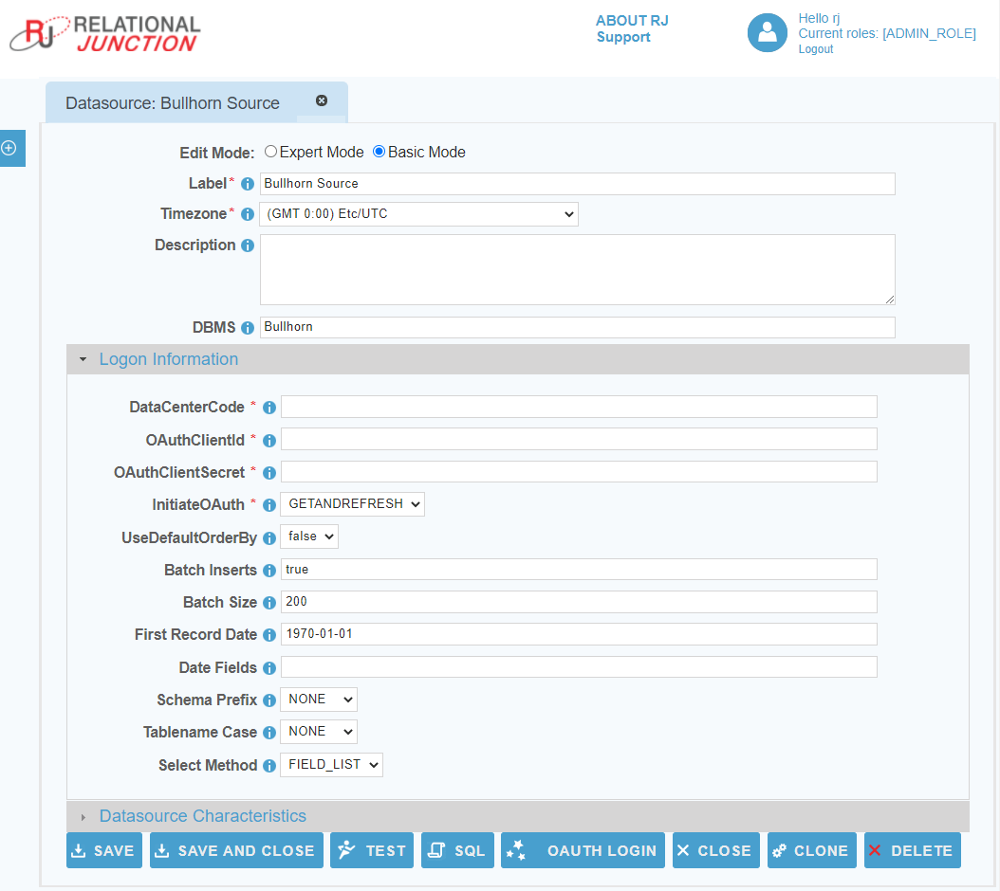

[comment]: # (Change Heading to reflect Datasource)

## Datasource Guide for Bullhorn CRM

[comment]: # (Leave Nav BAR untouched)

---
[comment]: # (Leave Or Alter Required info as needed)

### *Required Information*

* **Data Center Code**
* **OAuth Client ID**
* **OAuth Client Secret**

### Steps

[comment]: # (step 1 is common to all Datasources)
[comment]: # (Step 2.1and 2.2 should be adjusted for Data Source specific)
[comment]: # (Step 3 should be Image of the datasource you can add the screenshot to the images folder or create a placeholder like {image of datasource screen})
[comment]: # (adjust step 4 and below as needed)

1. Before you begin, obtain:
   * [Bullhorn Credentials](additionalinfo/BullhornCreds.md)

2. From the front page of the RJ UI, go to the left hand side and click **Datasources &rarr; New Datasource**
2. On the next screen, choose a label for your Datasource.
   1. Recommended: ‘Bullhorn Source’ or something similar.
   2. Select Bullhorn Template
   3. Click Save

3. Logon Information Section
   1. Data Center Code: *The data center code where your account's data is hosted, for example, CLS2, CLS5 etc...*
   2. OAuth Client ID: *The client ID assigned when you register your application with an OAuth authorization server.*
   3. OAuth Client Secret: *The client secret assigned when you register your application with an OAuth authorization server.*
4. Click Test
   *Note: If this is a new datasource you will be presented with a Bullhorn login screen in order to complete the authentication process.*
5. If Datasource is being use as a source
   1. Date fields
      1. This is a comma separated list of fields tht contain dates for use in incremental downloads
      2. Choose any and all date fields in the Schema that are altered during a create or update of the records
      3. The order of precedence is from left to right in what date field is chosen. given a date field list `LastModifiedDate, CreatedDate` when the tables is queried it will see first if `LastModifiedDate` exists if it does use that for incremental. If it doesn't then it will use `CreateDate` if neither exist it will do a full table pull.
   2. First Record Date
      1. the oldest date found in the schema for the fields in the date field list. This helps to avoid slow startup of initial load will it queries empty time.
6. click Save and Close.
