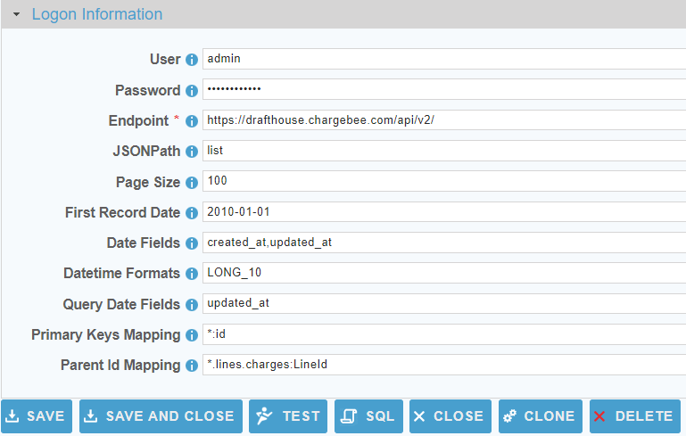

 <a href="http://www.sesamesoftware.com"></img></a>

[comment]: # (Change Heading to reflect Datasource)

#  Chargebee

[comment]: # (Leave Nav BAR untouched)

[[Installation](../guides/installguide.md)] [[Registration](../guides/RegistrationGuide.md)] [[Configuration](../guides/configurationGuide.md)] [[Datasource](../guides/DatasourceGuide.md)]

---

[comment]: # (Leave Or Alter Required info as needed)

### *Required Information*

* **User**
* **Password**
* **Endpoint**

### Steps

[comment]: # (step 1 is common to all Datasources)
[comment]: # (Step 2.1and 2.2 should be adjusted for Data Source specific)
[comment]: # (Step 3 should be Image of the datasource you can add the screenshot to the images folder or create a placeholder like {image of datasource screen})
[comment]: # (adjust step 4 and below as needed)

1. From the front page of the RJ UI, go to the left hand side and click **Datasources --> New Datasource**

2. On the next screen, choose a label for your Datasource.
	1. Recommended: `Source Chargebee` or something similar.
	2. Select Chargebee Template
	3. Click Save
   
   

3. Logon Information Section
   1. User
      1. Chargebee API User
   2. Password
      1. Password for the Chargebee API user.
   3. Endpoint
      1. Endpoint to the Chargebee REST API 
      2. Example: `https://[YOURCOMPANY].chargebee.com/api/v2/` 
         1.  Last forward slash required.
   
4. Extended Properties
   1. JSONPath
      1. Will always default to "list" for Chargebee. No need to set manually.
   2. Page Size
      1. Number of records to return from each REST request (defaults to 100).
   3. First Record Date
      1. When doing date range queries this tells the the Job all records are after this date.
   4. Date Fields
      1. The fields in the source objects that are date fields (comma delimited string). You can also use the star (\*) wildcard like such: LastModified\*
   5.  Datetime Formats
       1.  Dates in Chargebee are stored as 10 digit timestamp to the second `(LONG_10)`. You should not need to modify this setting. 
   6.  Query Date Fields
       1.  The date field to do incremental date range queries against. Defaults to updated_at.
   7.  Primary Keys Mapping
       1.  How to identify the primary keys of the objects. 
       2.  Format: `{objectName}:{fieldName},{objectName2}:{fieldName2}`
       3.  Examples:
           1.  All Primary Key Mappings are Case Sensitive.
           2.  With Wilcard: `*.id`
           3.  One to one: `subscriptions:id`
   8.  Parent Id Mapping
       1.  This property can be ignored for Chargebee.
5. Click Test
6. Once you see Connection Test Successful, click Save and Close.

---

[[&#9664; Datasource Guide](../guides/DatasourceGuide.md)]

  <a href="http://www.sesamesoftware.com"></img></a> 

