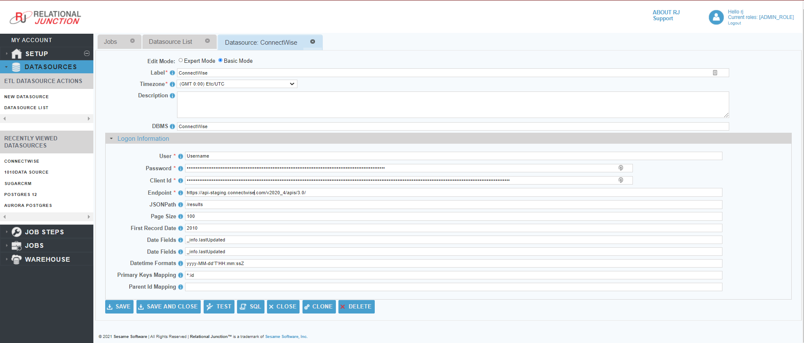

 <a href="http://www.sesamesoftware.com"></img></a>

[comment]: # (Change Heading to reflect Datasource)

# Connectwise

[comment]: # (Leave Nav BAR untouched)

[[Installation](../guides/installguide.md)] [[Registration](../guides/RegistrationGuide.md)] [[Configuration](../guides/configurationGuide.md)] [[Datasource](../guides/DatasourceGuide.md)]

---

[comment]: # (Leave Or Alter Required info as needed)

### *Required Information*

* **User**
* **Password**
* **Client ID**
* **Endpoint**

### Steps

[comment]: # (step 1 is common to all Datasources)
[comment]: # (Step 2.1and 2.2 should be adjusted for Data Source specific)
[comment]: # (Step 3 should be Image of the datasource you can add the screenshot to the images folder or create a placeholder like {image of datasource screen})
[comment]: # (adjust step 4 and below as needed)

1. From the front page of the RJ UI, go to the left hand side and click **Datasources &rarr; New Datasource**
2. On the next screen, choose a label for your Datasource.
   1. Recommended: ‘Source Connectwise’ or something similar.
   2. Select Connectwise Template
   3. Click Save
3. 
4. Logon Information Section
   1. Username: *User name+public key, + is required*
   2. Password: *User password*
   3. Client ID: *Connectwise integrated client ID*
   4. Endpoint: *Connectwise API URL (API URL example: https://" + SiteUrl + "/" + Codebase + "apis/3.0/)*
5. If the Datasource is being used as a source:
      1. Date fields
         1. _info.lastUpdated
      2. First Record Date
         1. The oldest date found in the schema for the fields in the date field list. This helps to avoid slow startup of initial load where it will query empty time.
6. Click Test
7. Once you see Connection Test Successful, click Save and Close.
8. When setting up this datasource the config needs to run as restricted with a specified list of objects.
   1. See additional information [Connectwise Tables](additionalinfo/ConnectwiseTables.md)

---

[[&#9664; Datasource Guide](../guides/DatasourceGuide.md)]

  <a href="http://www.sesamesoftware.com"></img></a> 

