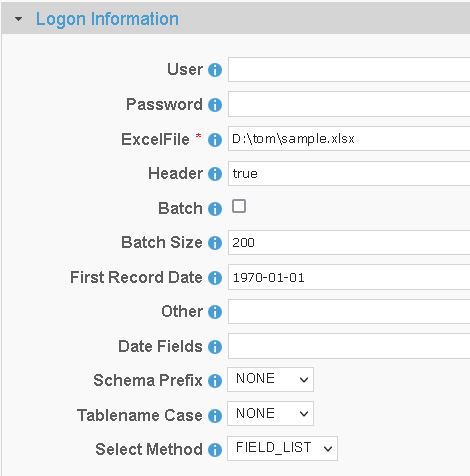

[comment]: # (Change Heading to reflect Datasource)

## Datasource Guide for Excel

[comment]: # (Leave Nav BAR  untouched)

[[Installation](../guides/installguide.md)] [[Registration](../guides/RegistrationGuide.md)] [[Configuration](../guides/configurationGuide.md)] [[Datasource](../guides/DatasourceGuide.md)]

---
[comment]: # (Leave Or Alter Required info as needed)

### *Required Information*

* ***Excel File***

### Steps

[comment]: # (step 1 is common to all Datasources)
[comment]: # (Step 2.1and 2.2 should be adjusted for Data Source specific)
[comment]: # (Step 3 should be Image of the datasource you can add the screenshot to the images folder or create a placeholder like {image of datasource screen})
[comment]: # (adjust step 4 and below as needed)

1. From the front page of the RJ UI, go to the left hand side and click **Datasources --> New Datasource**
2. On the next screen, choose a label for your Datasource.
   1. Recommended: ‘Source Excel or something similar.
   2. Select Excel Template
   3. Click Save
3. 
4. Logon Information Section
   1. Excel File: *The Uniform Resource Identifier (URI) for the Excel resource location.  Must include the fule name of the Excel file.  Note that highly formatted Excel files are not supported.*
5. Click Test
    1. If you see Connection Test Successful
      1. Click the SQL Button and perform a simple query to confirm that data is visible to the User. Example select * from sheet1.
      2. If no data is returned follow the instruction for a connection Test Failed below.
   2. If you see Connection Test Failed Check your URI and try again.
6. If Datasource is being use as a source
   1. Date fields
      1. This is a comma separated list of fields that contain dates for use in incremental downloads
      2. Choose any and all date fields in the Schema that are altered during a create or update of the records
      3. The order of precedence is from left to right in what date field is chosen. given a date field list `LastModifiedDate, CreatedDate` when the tables is queried it will see first if `LastModifiedDate` exists if it does use that for incremental. If it doesn't then it will use `CreateDate` if neither exist it will do a full table pull.
   2. First Record Date
      1. the oldest date found in the schema for the fields in the date field list. This helps to avoid slow startup of initial load will it queries empty time.
7. click Save and Close.
