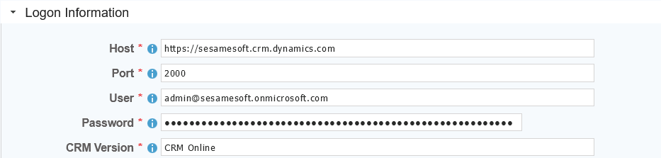

 <a href="http://www.sesamesoftware.com"></img></a>

# Microsoft Dynamics CRM

[[Installation](../guides/installguide.md)] [[Registration](../guides/RegistrationGuide.md)] [[Configuration](../guides/configurationGuide.md)] [[Datasource](../guides/DatasourceGuide.md)]

---
### Required Information

* **Host**
* **Port**
* **User**
* **Password**
* **CRM Version**

### Steps

1. From the front page of the RJ UI, go to the left hand side and click **Datasources --> New Datasource**
2. On the next screen, choose a label for your Datasource.
   1. Recommended: ‘Source MSDynamics' or something similar.
   2. Select MSDynamics Template
   3. Click Save
3. Logon Information Section
   1. Host: The address to the rest endpoint
   2. Port: Server url
   3. User
   4. Password
   5. CRM Version: Defaults to 'CRM Online'
4. Click Test
   1. If you see Connection Test Successful
5. If the Datasource is being use as a source
   1. Date fields
      1. This is a comma separated list of fields that contain dates for use in incremental downloads.
      2. Choose any and all date fields in the Schema that are altered during a create or update of the records.
      3. The order of precedence is from left to right in what date field is chosen. Given a date field list `LastModifiedDate, CreatedDate` when the tables is queried it will check first if `LastModifiedDate` exists if it does, it will use that for incremental. If it doesn't then it will use `CreateDate`. If neither exist it will do a full table pull.
   2. First Record Date
      1. The oldest date found in the schema for the fields in the date field list. This helps to avoid slow startup of initial load while it queries empty time.
6. Click Save and Close.

---

[[&#9664; Datasource Guide](../guides/DatasourceGuide.md)]

  <a href="http://www.sesamesoftware.com"></img></a> 

