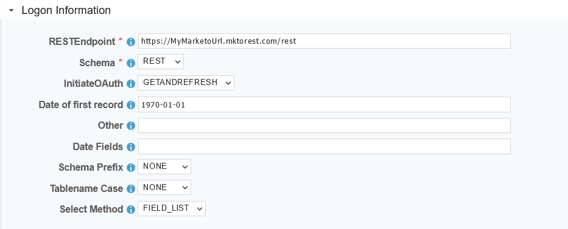
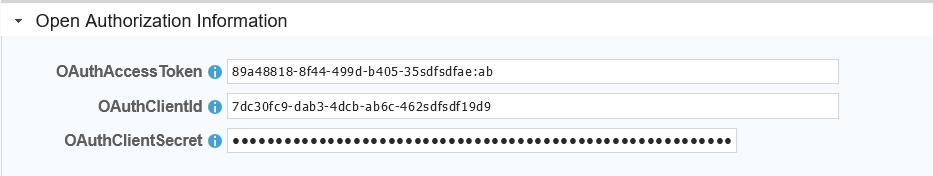

## Datasource Guide for Marketo

[](../guides/installguide.md)[](../guides/installguide.md)[](../guides/RegistrationGuide.md)[](../guides/configurationGuide.md)[](README.md)

---

### *Required Information*

* **RESTEndpoint** The url to the marketo rest api. 
* **Access Tokens** The OAuth Token, Client ID, and client secret generated in Marketo

### *Steps*

1. Before you begin, set up API access and obtain OAuth tokens:
   2. [OAuth Credentials](additionalinfo/MarketoCreds.md)
2. From the frontpage of the RJ UI, go to the left hand side and click **Datasources --> New Datasource**
3. On the next screen, choose a label for your Datasource.
   1. Recommended: ```Source Marketo``` or something similar.
4. Select the Marketo Template
5. 
6. Logon Information Section 
   1. RESTEndpoint
7. 
8. Open Authorization Section - Authorization Tokens from Marketo
   1. Application ID Tokens
      1. OAuthAccessToken
   2. Login Tokens
      1. OAuthClientId
      2. OAuthClientSecret
9. Click Test
10. Save and Close.

[](README.md)
