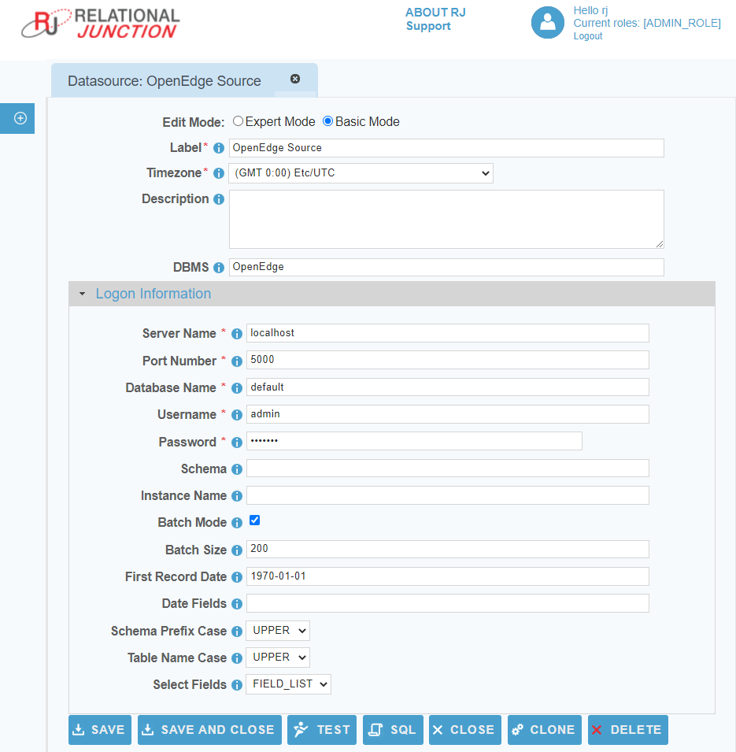

 <a href="http://www.sesamesoftware.com"></img></a>

#  Progress OpenEdge

[[Installation](../guides/installguide.md)] [[Registration](../guides/RegistrationGuide.md)] [[Configuration](../guides/configurationGuide.md)] [[Datasource](../guides/DatasourceGuide.md)]

---

### *Required Information*

* **Server Name**
* **Port**
* **Database Name**
* **User Name**
* **Password**

### Steps

1. From the front page of the RJ UI, go to the left hand side and click **Datasources --> New Datasource**
2. On the next screen, choose a label for your Datasource.
   1. Recommended: "OpenEdge Source" or something similar.
   2. Select OpenEdge Template
   3. Click Save

3. Logon Information Section
   1. Server Name: *ip or dns of database server*
   2. Port: *port number of database server*
   3. Database name: *name of the database*
   4. Username: *login name for database user*
   5. Password: *password for database user*
4. Click Test
5. If Datasource is being use as a source
   1. Date fields
      1. This is a comma separated list of fields that contain dates for use in incremental downloads
      2. Choose any and all date fields in the Schema that are altered during a create or update of the records
      3. The order of precedence is from left to right in what date field is chosen. given a date field list `LastModifiedDate, CreatedDate` when the tables is queried it will see first if `LastModifiedDate` exists if it does use that for incremental. If it doesn't then it will use `CreateDate` if neither exist it will do a full table pull.
   2. First Record Date
      1. The oldest date found in the schema for the fields in the date field list. This helps to avoid slow startup of initial load will it queries empty time.
6. Click Save and Close.

---

[[&#9664; Datasource Guide](../guides/DatasourceGuide.md)]

  <a href="http://www.sesamesoftware.com"></img></a> 

