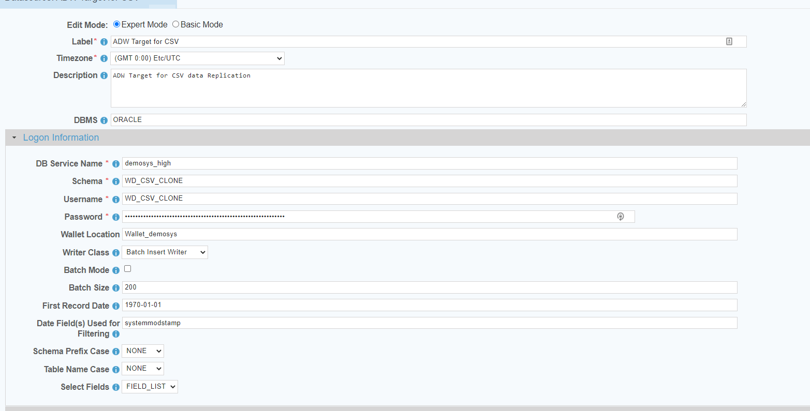

 <a href="http://www.sesamesoftware.com"></img></a>

# Oracle Autonomous JSON Database

[[Installation](../guides/installguide.md)] [[Registration](../guides/RegistrationGuide.md)] [[Configuration](../guides/configurationGuide.md)] [[Datasource](../guides/DatasourceGuide.md)]

---

### *Required Information*

* **Wallet File**
* **Service Name**
* **User Name**
* **Password**
* **Schema**

### Steps

1. From the front page of the RJ UI, go to the left hand side and click **Datasources --> New Datasource**
2. On the next screen, choose a label for your Datasource.
   1. Recommended: `Source AJD` or something similar.
   2. Select OracleAJD Template
   3. Click Save
   
3. Logon Information Section
   1. DB Service Name
      1. Should be dbname _high, medium or low 
      2. Example: ``demosys_high``. 
      3. You can find this in the tns file in the wallet.
   2. Schema
      1. Typically the same as database username
      2. Typically requires all uppercase.
   3. Username
      1. Login name for database user.
   4. Password
      1. Password for database user.
   5. Wallet Location
      1. Name of the wallet file without the .zip extension.
4. Click File Wizard at the bottom of the screen
   
   1. Click Choose File and navigate to your folder that contains the wallet file.
   2. Click Upload.
   3. Click Close.
6. If Datasource is being use as a source
   1. Date Fields
      1. This is a comma separated list of fields that contain dates for use in incremental downloads
      2. Choose any and all date fields in the Schema that are altered during a create or update of the records
      3. The order of precedence is from left to right in what date field is chosen, given a date field list `LastModifiedDate, CreatedDate` when the tables is queried it will see first if `LastModifiedDate` exists if it does use that for incremental. If it doesn't then it will use `CreateDate` if neither exist it will do a full table pull.
   2. First Record Date
      1. The oldest date found in the schema for the fields in the date field list. This helps to avoid slow startup of initial load will it queries empty time.
5. Click Test
6. Once you see Connection Test Successful, click Save and Close.
---

[[&#9664; Datasource Guide](../guides/DatasourceGuide.md)]

  <a href="http://www.sesamesoftware.com"></img></a> 

