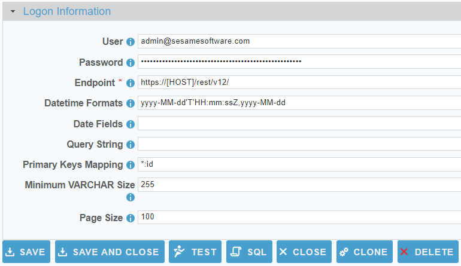

 <a href="http://www.sesamesoftware.com"></img></a>

# Oracle CPQ

[comment]: # (Leave Nav BAR untouched)

[[Installation](../guides/installguide.md)] [[Registration](../guides/RegistrationGuide.md)] [[Configuration](../guides/configurationGuide.md)] [[Datasource](../guides/DatasourceGuide.md)]

---
[comment]: # (Leave Or Alter Required info as needed)

### *Required Information*

* **User**
* **Password**
* **Endpoint**

### Steps

[comment]: # (step 1 is common to all Datasources)
[comment]: # (Step 2.1and 2.2 should be adjusted for Data Source specific)
[comment]: # (Step 3 should be Image of the datasource you can add the screenshot to the images folder or create a placeholder like {image of datasource screen})
[comment]: # (adjust step 4 and below as needed)

1. From the front page of the RJ UI, go to the left hand side and click **Datasources --> New Datasource**

2. On the next screen, choose a label for your Datasource.
	1. Recommended: ‘Source Oracle CPQ’ or something similar.
	2. Select OracleCPQ Template
	3. Click Save
   
3. 

4. Logon Information Section
	1. **User**: *Oracle CPQ REST API User*
	2. **Password**: *Password for the given user*
	3. **Endpoint**: *Endpoint to the Oracle CPQ REST API such as **https://[HOST]/rest/v12/** (please include the last forward slash)*
   
5. Click Test
	1. You see Connection Test Successful
   
6. Extended Properties
	1. **Datetime Formats**: Format of the datetime fields defined in the "Date Fields" property The standard Oracle CPQ datetime formats are already pre-populated.
	2. **Date Fields**: The fields in the source objects that are date fields (comma delimited string). You can also use the star (\*) wildcard like such: LastModified\*
	3. **Query String**: Additional URL query parameters (must start with &). For Oracle CPQ the query needs to be in JSON format like such:
		1. &q={System:"Interactive"}
	4. **Primary Keys Mapping**: For Oracle CPQ this is always *:id
	6. **Minimum VARCHAR Size**: All CPQ String fields are defaulted to length of 255 but never less. The minimum size of VARCHAR fields can be used increase the default length but not decrease it. 
	7. **Page Size**: Number of records to return from each REST request (defaults to 100).

7. Click Save and Close.

---

[[&#9664; Datasource Guide](../guides/DatasourceGuide.md)]

  <a href="http://www.sesamesoftware.com"></img></a> 

