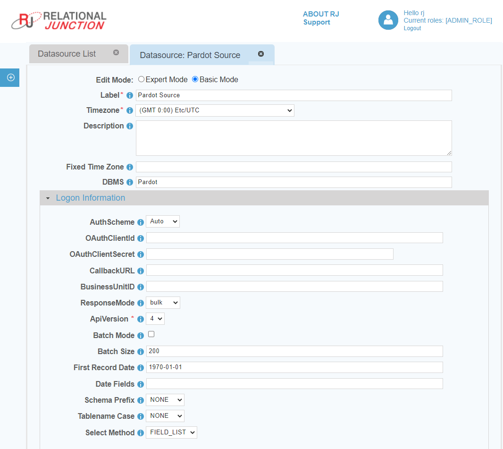

 <a href="http://www.sesamesoftware.com"></img></a>

# Pardot

[[Installation](../guides/installguide.md)] [[Registration](../guides/RegistrationGuide.md)] [[Configuration](../guides/configurationGuide.md)] [[Datasource](../guides/DatasourceGuide.md)]

---

[comment]: # (Leave Or Alter Required info as needed)

### *Required Information*

* **Client ID**
* **Client Secret**
* **Callback URL**
* **Business Unit ID**

### Steps

[comment]: # (step 1 is common to all Datasources)
[comment]: # (Step 2.1and 2.2 should be adjusted for Data Source specific)
[comment]: # (Step 3 should be Image of the datasource you can add the screenshot to the images folder or create a placeholder like {image of datasource screen})
[comment]: # (adjust step 4 and below as needed)

1. Before you begin, please read and obtain the required connection information from the following document:
   1. [Pardot Credentials](additionalinfo/PardotCreds.md)
2. From the front page of the RJ UI, go to the left hand side and click **Datasources --> New Datasource**
3. On the next screen, choose a label for your Datasource.
   1. Recommended: `Pardot Source` or something similar.
   2. Select Pardot Template
   3. Click Save
 
4. Logon Information Section
   1. OAuthClientId
      1. The client ID assigned when you register your application with an OAuth authorization server.
   2. OAuthClientSecret
      1. The client secret assigned when you register your application with an OAuth authorization server.
   3. CallbackURL
      1. The OAuth callback URL to return to when authenticating. This value must match the callback URL you specify in your app settings.
   4. BusinessUnitID
      1. Your Salesforce Pardot Business Unit ID (BU).
5. If Datasource is being use as a source:
   1. Date Fields
      1. This is a comma separated list of fields tht contain dates for use in incremental downloads
      2. Choose any and all date fields in the Schema that are altered during a create or update of the records
      3. The order of precedence is from left to right in what date field is chosen. given a date field list `LastModifiedDate, CreatedDate` when the tables is queried it will see first if `LastModifiedDate` exists if it does use that for incremental. If it doesn't then it will use `CreateDate` if neither exist it will do a full table pull.
   2. First Record Date
      1. The oldest date found in the schema for the fields in the date field list. This helps to avoid slow startup of initial load will it queries empty time.
6. Click Test
7. Once you see Connection Test Successful, click Save and Close.

*Note: If this is a new datasource you will be presented with a Pardot login screen in order to complete the authentication process.*

---

[[&#9664; Datasource Guide](../guides/DatasourceGuide.md)]

  <a href="http://www.sesamesoftware.com"></img></a> 
