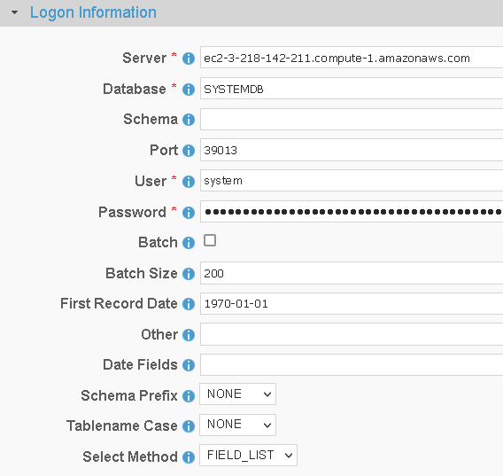

 <a href="http://www.sesamesoftware.com"></img></a>

[comment]: # (Change Heading to reflect Datasource)

#  SAP Hana

[comment]: # (Leave Nav BAR untouched)

[[Installation](../guides/installguide.md)] [[Registration](../guides/RegistrationGuide.md)] [[Configuration](../guides/configurationGuide.md)] [[Datasource](../guides/DatasourceGuide.md)]

---

[comment]: # (Leave Or Alter Required info as needed)

### *Required Information*

* **Server**
* **Database**
* **User**
* **Password**

### Steps

[comment]: # (step 1 is common to all Datasources)
[comment]: # (Step 2.1and 2.2 should be adjusted for Data Source specific)
[comment]: # (Step 3 should be Image of the datasource you can add the screenshot to the images folder or create a placeholder like {image of datasource screen})
[comment]: # (adjust step 4 and below as needed)

1. From the front page of the RJ UI, go to the left hand side and click **Datasources --> New Datasource**
2. On the next screen, choose a label for your Datasource.
   1. Recommended: ``Source SAP Hana`` or something similar.
   2. Select SAPHana Template
   3. Click Save
   
3. Logon Information Section
   1. Server
      1. The name of the server running SAP HANA database.
   2. Database
      1. The name of the SAP HANA database.
   1. User
      1. The SAP HANA user account used to authenticate.
   2. Password
      1. The password used to authenticate the user.
1. If the Datasource is being use as a source:
      1. Date fields
         1. This is a comma separated list of fields that contain dates for use in incremental downloads.
         2. Choose any and all date fields in the Schema that are altered during a create or update of the records.
         3. The order of precedence is from left to right in what date field is chosen. Given a date field list `LastModifiedDate, CreatedDate` when the tables is queried it will check first if `LastModifiedDate` exists if it does, it will use that for incremental. If it doesn't then it will use `CreateDate`. If neither exist it will do a full table pull.
      2. First Record Date
         1. The oldest date found in the schema for the fields in the date field list. This helps to avoid slow startup of initial load where it will query empty time.
2. Click Test
   1. If you see Connection Test Successful
      1. Click the SQL Button and perform a simple query to confirm that data is visible to the User. Example: ``select * from sample.``
   2. If no data is returned follow the instruction for a connection Test Failed below.
      1. Connection Test Failed: Check your URI and try again.
3. Once you see Connection Test Successful, click Save and Close.

---

[[&#9664; Datasource Guide](../guides/DatasourceGuide.md)]

  <a href="http://www.sesamesoftware.com"></img></a> 

