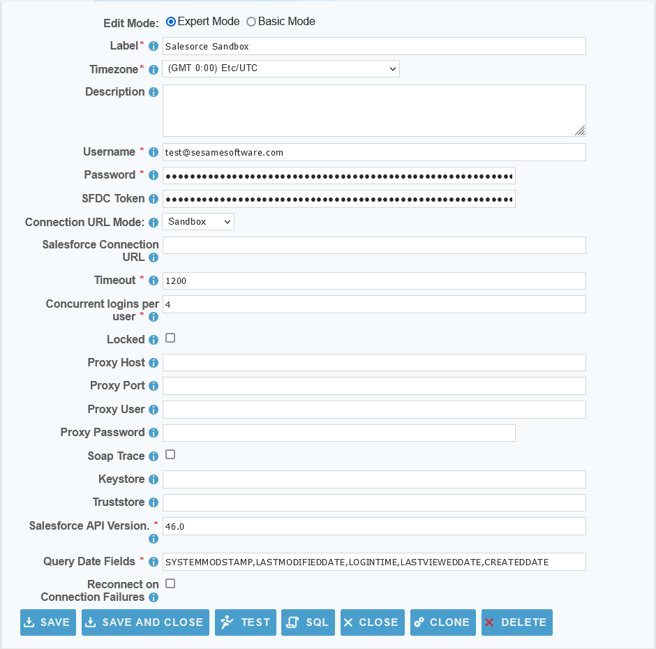

 <a href="http://www.sesamesoftware.com"></img></a>

[comment]: # (Change Heading to reflect Datasource)

#  Salesforce

[comment]: # (Leave Nav BAR untouched)

[[Installation](../guides/installguide.md)] [[Registration](../guides/RegistrationGuide.md)] [[Configuration](../guides/configurationGuide.md)] [[Datasource](../guides/DatasourceGuide.md)]

---

[comment]: # (Leave Or Alter Required info as needed)

### *Required Information*

* **User Name**
* **Password**
* **SFDC Token**
* **Connection URL Mode**
* **Salesforce Connection URL**
* **Timeout**
* **Concurrent logins per user**
* **Locked**
* **Proxy Host**
* **Proxy Port**
* **Proxy User**
* **Proxy Password**
* **Soap Trace**
* **Keystore**
* **Truststore**
* **Salesforce API Version**
* **Query Date Fields**
* **Reconnect on Connection Failures**

### Steps

[comment]: # (step 1 is common to all Datasources)
[comment]: # (Step 2.1and 2.2 should be adjusted for Data Source specific)
[comment]: # (Step 3 should be Image of the datasource you can add the screenshot to the images folder or create a placeholder like {image of datasource screen})
[comment]: # (adjust step 4 and below as needed)

1. From the front page of the RJ UI, go to the left hand side and click **Datasources --> New Datasource**
2. On the next screen, choose a label for your Datasource.
   1. Recommended: ‘Source Salesforce’ or something similar.
   2. Select Salecforce Template
   3. Click Save
3. 
4. Datasource Information
   1. Username: *Salesforce Username*
   2. Password: *Salesforce Password*
   3. SFDC Token: *Salesforce API Token*
   4. Connection URL Mode: *Override Salesforce Connection URL*
   5. Salesforce Connection URL: *Custom Salesforce Connection URL*
   6. Timeout: *Timeout in seconds*
   7. Concurrent logins per user: *The number of processes to use for parallel commands*
   8. Locked: *Whether this config is locked due to failed login attempts*
   9. Proxy Host: *The address of the proxy host you wish to use*
   10. Proxy Port: *The optional port for the proxy*
   11. Proxy User: *Proxy User*
   12. Proxy Password: *Proxy Password*
   13. Soap Trace: *Turn on soap trace logging*
   14. Keystore: *Keystore*
   15. Truststore: *Truststore*
   16. Salesforce API Version: *The Salesforce SOAP API version to connect with*
   18. Reconnect on Connection Failures: *Will reconnect on Salesforce connection failures but will run slower*
5. If the Datasource is being used as a source:
      1. Query Date fields
         1. This is a comma separated list of fields that contain dates for use in incremental downloads.
         2. Choose any and all date fields in the Schema that are altered during a create or update of the records.
         3. The order of precedence is from left to right in what date field is chosen. Given a date field list `LastModifiedDate, CreatedDate` when the tables is queried it will check first if `LastModifiedDate` exists if it does, it will use that for incremental. If it doesn't then it will use `CreateDate`. If neither exist it will do a full table pull.
7. Click Test
8. Once you see Connection Test Successful, click Save and Close.

---

[[&#9664; Datasource Guide](../guides/DatasourceGuide.md)]

  <a href="http://www.sesamesoftware.com"></img></a> 

