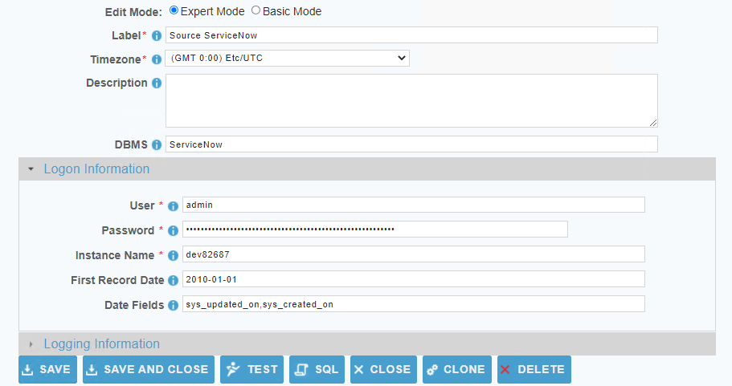

[comment]: # (Change Heading to reflect Datasource)

## Datasource Guide for ServiceNow

[comment]: # (Leave Nav BAR untouched)

---
[comment]: # (Leave Or Alter Required info as needed)

### *Required Information*

* **User**
* **Password**
* **Instance Name**
* **First Record Date**
* **Date Fields**

### Steps

[comment]: # (step 1 is common to all Datasources)
[comment]: # (Step 2.1and 2.2 should be adjusted for Data Source specific)
[comment]: # (Step 3 should be Image of the Datasource you can add the screenshot to the images folder or create a placeholder like {image of Datasource screen})
[comment]: # (adjust step 4 and below as needed)

1. From the front page of the RJ UI, go to the left hand side and click **Datasources --> New Datasource**
2. On the next screen, choose a label for your Datasource.
   1. Recommended: ‘Source ServiceNow’ or something similar.
   2. Select ServiceNow Template
   3. Click Save
3. 
4. Logon Information Section
   1. User: *ip or dns of database server*
   2. Password: *Password for database user*
   3. Instance Name: *Name of your instance, this is the first value presented in the URL. ex: mycompany from mycompany.servicenow.com*
   4. First Record Date: *This is the date of the first created record in your instance and takes the form YYYY-MM-DD.*
   5. Date Fields: *These are the date fields that will be used in order of priority for incrementalism. This is in the form of a lowercase comma separated list.*
5. Click Test
   1. If you see Connection Test Successful
      1. Click the SQL Button and perform a simple query to confirm that data is visible to the User. example `SELECT sys_created_on FROM system_dictionary`
      2. If no data is returned follow the instruction for a connection Test Failed below.
   2. If you see Connection Test Failed
      2. Check your User, Password, and Instance name and try again.
6. click Save and Close.
7. Proceed to 
