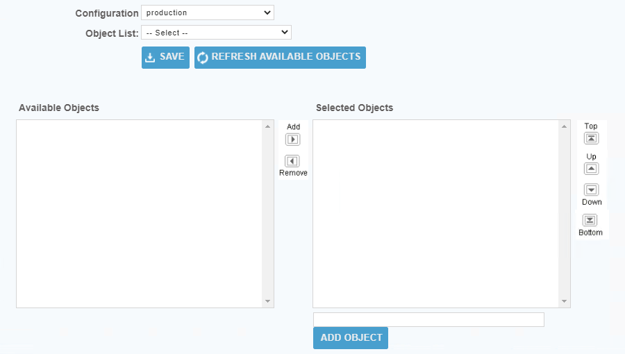

## Table Discovery
1. Table information can be gleaned from the 'sys_db_object' table, known as 'system_db_object' to RelationJunction Warehouse. 
2. In ServiceNow system tables begin with 'sys_'. Within RelationalJunction Warehouse system tables must be referenced with 'system_' instead of 'sys_'
3. To retrieve the listing of Tables, use the Table Selection for ServiceNow explained below to add the 'system_db_object' table to a download.config.initial_service_now file. 
4. Update a Warehouse configuration that makes use of your ServiceNow datasource and the Target datasource of your choosing to be a restricted download utilizing the download.config.initial_service_now file and then save and close the Warehouse configuration. 
5. Create a new job with a -getGlobal Job Step making use of the Warehouse Configuration that was modified. Save and Run the Job. 
6. The 'system_db_object' table will be added to the target database and populated with data.
7. One can now use the data from the target database to pull a full list of tables from one's ServiceNow instance. An example of a basic SQL query to accomplish this would look like    
   `SELECT DISTINCT name FROM system_db_object`    
Keep in mind that you will need to replace any name beginning with 'sys_' with 'system_' which may want to do by altering the above query. 
8. Export the result list to a flat file with one table name per line. The name format of the file must be download.config.&lt;some_name&gt; where &lt;some_name&gt; is a meaningful name of your choosing, use '_' instead of spaces or special characters in the name. The file must be placed in the $RJ_HOME\1000\rjwarehouse\conf folder to be available for use and the Warehouse Configuration that is to use the new download.config file must be updated with the new name in the Download Config field.

NOTE: Just because a table is listed in ServiceNow's 'sys_db_object' table it does not guarantee the user used to connect to ServiceNow will have the permissions required to access the data of the table.

## Table Selection for ServiceNow

1. From the front page of the RJ UI, go to the left hand side and click **Warehouse --> SELECT TABLES TO LOAD**

2. Select the Warehouse Configuration setup for your ServiceNow Datasource or select any other Configuration to setup the Warehouse Configuration later.
3. Leave the Object List set to -- Select --
4. For each table to be used, enter the API name of the table as presented in ServiceNow into the input box at the bottom of the Selected Objects section and then click the ADD OBJECT button.
5. When all tables have been added click the SAVE button.
   1. A Save modal window will open.
   2. Type the name download.config.&lt;some_name&gt;, where &lt;some_name&gt; is a meaningful name of your choosing, use '_' instead of spaces or special characters in the name, into the 'Save as:' text field. You will need to use this name in the Warehouse Configuration's Database Design section --> Download Config field.
   3. Click the Save button.
