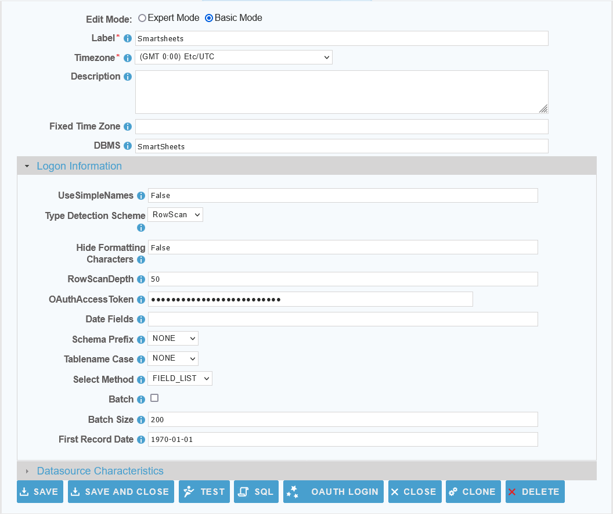
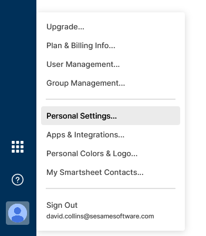
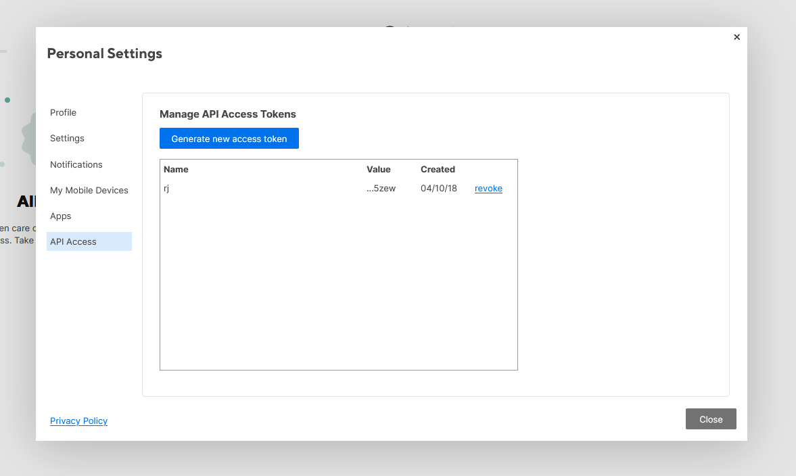

 <a href="http://www.sesamesoftware.com"></img></a>

[comment]: # (Change Heading to reflect Datasource)

#  Smartsheet

[comment]: # (Leave Nav BAR untouched)

[[Installation](../guides/installguide.md)] [[Registration](../guides/RegistrationGuide.md)] [[Configuration](../guides/configurationGuide.md)] [[Datasource](../guides/DatasourceGuide.md)]

---

[comment]: # (Leave Or Alter Required info as needed)

### *Required Information*

* **OAuthAccessToken**

### Steps

[comment]: # (step 1 is common to all Datasources)
[comment]: # (Step 2.1and 2.2 should be adjusted for Data Source specific)
[comment]: # (Step 3 should be Image of the datasource you can add the screenshot to the images folder or create a placeholder like {image of datasource screen})
[comment]: # (adjust step 4 and below as needed)

1. From the front page of the RJ UI, go to the left hand side and click **Datasources --> New Datasource**
2. On the next screen, choose a label for your Datasource.
   1. Recommended: ‘Source Smartsheet or something similar.
   2. Select Smartsheet Template
   3. Click Save

3. Logon Information Section
   1. OAuthAccessToken: *API Token from Smartsheet*

4. Obtaining an API Token 

5. Log into Smartsheet and click on 'Account' in the bottom left and then 'Personal Settings'

6. Click on 'API Access' and then 'Generate new access token'.  This will be used in the OAuthAccessToken field.
7. Return to the datasource in relationaljunction and click Test.
8. Once you see Connection Test Successful, click Save and Close.

---

[[&#9664; Datasource Guide](../guides/DatasourceGuide.md)]

  <a href="http://www.sesamesoftware.com"></img></a> 

