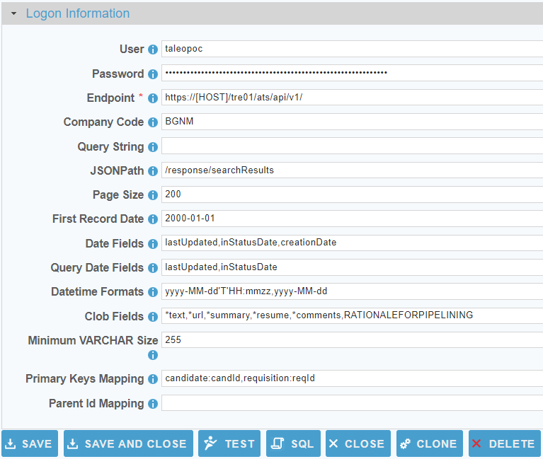

[comment]: # (Change Heading to reflect Datasource)

## Oracle Taleo

[comment]: # (Leave Nav BAR untouched)

[[Installation](../guides/installguide.md)] [[Registration](../guides/RegistrationGuide.md)] [[Configuration](../guides/configurationGuide.md)] [[Datasource](../guides/DatasourceGuide.md)]

---

[comment]: # (Leave Or Alter Required info as needed)

### *Required Information*

* **User**
* **Password**
* **Endpoint**
* **Company Code**

### Steps

[comment]: # (step 1 is common to all Datasources)
[comment]: # (Step 2.1and 2.2 should be adjusted for Data Source specific)
[comment]: # (Step 3 should be Image of the datasource you can add the screenshot to the images folder or create a placeholder like {image of datasource screen})
[comment]: # (adjust step 4 and below as needed)

1. From the front page of the RJ UI, go to the left hand side and click **Datasources --> New Datasource**

2. On the next screen, choose a label for your Datasource.
	1. Recommended: ‘Source Oracle Taleo’ or something similar.
	2. Select OracleTaleo Template
	3. Click Save
   
3. 

4. Logon Information Section
	1. **User**: *Oracle Taleo API User*
	2. **Password**: *Password for the given user*
	3. **Endpoint**: *Endpoint to the Oracle Taleo REST API such as **https://[HOST]/tre01/ats/api/v1/** (please include the last forward slash)*
	4. **Company Code**: *Unique Taleo Business Edition company instance*
   
5. Click Test
	1. You see Connection Test Successful
   
6. Extended Properties
	1. **Query String**: Additional URL query parameters (must start with &)
	2. **JSONPath**: Path to the JSON Array. For Oracle Taleo it should always be: /response/searchResults
	3. **Page Size**: Number of records to return from each REST request (defaults to 100).
	4. **First Record Date**: When doing date range queries this tells the the Job all records are after this date.
	5. **Date Fields**: The fields in the source objects that are date fields (comma delimited string). You can also use the star (\*) wildcard like such: LastModified\*
	6. **Query Date Fields**: The date field to do incremental date range queries against. Defaults to lastUpdated,inStatusDate.
	7. **Datetime Formats**: Oracle Taleo datetime formats default to yyyy-MM-dd'T'HH:mmzz,yyyy-MM-dd. You should not need to modify this setting.
	8. **Clob Fields**: Comma delimited list of fields designated as CLOB data types. The star wildcard can be used like such: *text 
	9. **Minimum VARCHAR Size**: All String fields are defaulted to length of 255 but never less. The minimum size of VARCHAR fields can be used increase the default length but not decrease it.
	10. **Primary Keys Mapping**: How to identify the primary keys of the objects. Format is (note the comma delimiter): {objectName}:{fieldName},{objectName2}:{fieldName2}
		1. Examples (All Primary Key Mappings are Case Sensitive):
			1. With Wilcard: *:candId
			2. One to one: candidate:candId
	11. **Parent ID Mapping**: How to identify the Parent ID of an object. Format is (note the comma delimiter): {objectName}:{parentIdName},{objectName2}:{parentIdName2}

7. Click Save and Close.

---

[[&#9664; Datasource Guide](../guides/DatasourceGuide.md)]

  <a href="http://www.sesamesoftware.com"></img></a> 

