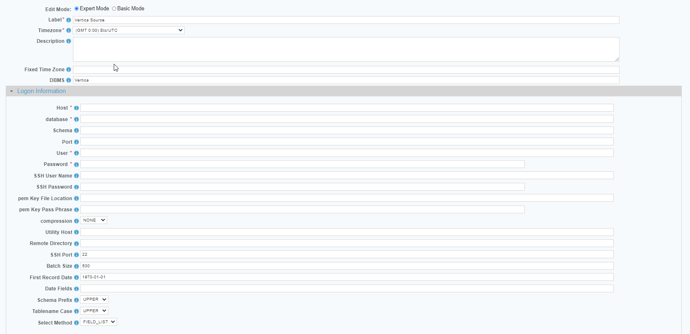

 <a href="http://www.sesamesoftware.com"></img></a>

[comment]: # (Change Heading to reflect Datasource)

#  Vertica

[comment]: # (Leave Nav BAR untouched)

[[Installation](../guides/installguide.md)] [[Registration](../guides/RegistrationGuide.md)] [[Configuration](../guides/configurationGuide.md)] [[Datasource](../guides/DatasourceGuide.md)]

---

[comment]: # (Leave Or Alter Required info as needed)

### *Required Information*

* **Host**
* **Database**
* **Schema**
* **Port**
* **User**
* **Password**
* **Utility Host**
* **Remote Directory**
* **SSH port**

*Choose either SSH or pem Key*
* **SSH User Name**
* **SSH User Password**
* **pem Key File Location**
* **pem Key Pass Phrase**

### Steps

[comment]: # (step 1 is common to all Datasources)
[comment]: # (Step 2.1and 2.2 should be adjusted for Data Source specific)
[comment]: # (Step 3 should be Image of the datasource you can add the screenshot to the images folder or create a placeholder like {image of datasource screen})
[comment]: # (adjust step 4 and below as needed)

1. From the front page of the RJ UI, go to the left hand side and click **Datasources --> New Datasource**
2. On the next screen, choose a label for your Datasource.
   1. Recommended: ‘Vertica Target' or something similar.
   2. Select Vertica Template
   3. Click Save
   
   
   
3. Logon Information Section
   1. Host: *IP address or host of Vertica database server*
   2. Database: *Name of the database to connect to*
   3. Schema: *Database schema.*
   4. Port: *Port to connect to.*
   5. User: *Login name for database user*
   6. Password: *Password for database user*
   7. SSH User Name: *User name to connect to Vertica Server via SSH.*
   8. SSH Password: *Password to connect to Vertica Server via SSH.*
   9. pem Key File Location: *Location of the .pem private key file.*
   10. pem Key Pass Phrase: *Password or Pass Phrase of the pem private Key.*
   11. Compression: *Type of compression on .csv file.*
       1.  TAR
       2.  GunZip
   12. Utility Host: *Host where the file will be loaded.*
   13. Remote Directory: *Remote Directory where the file will be loaded.*
   14. SSH Port: *Default 22*
   15. Batch Size *Default 500*
   16. First Record Date *Default 1970-01-01*
   17. Date Fields *See below*
   18. Schema Prefix Case: *UPPER/LOWER, if required.*
   19. Tablename Case: *UPPER/LOWER, if required.*
   20. SSL: *true or false, depending upon your system.*
4. If the Datasource is being use as a source:
      1. Date fields
         1. This is a comma separated list of fields that contain dates for use in incremental downloads.
         2. Choose any and all date fields in the Schema that are altered during a create or update of the records.
         3. The order of precedence is from left to right in what date field is chosen. Given a date field list `LastModifiedDate, CreatedDate` when the tables is queried it will check first if `LastModifiedDate` exists if it does, it will use that for incremental. If it doesn't then it will use `CreateDate`. If neither exist it will do a full table pull.
      2. First Record Date
         1. The oldest date found in the schema for the fields in the date field list. This helps to avoid slow startup of initial load where it will query empty time.
5. Click Test
6. Once you see Connection Test Successful, click Save and Close.

### Additional Configuration

   1. When setting up your Warehouse configuration file you have to set **USE INTERNATINALIZATION** to false in the database design section
   2. The rj.database.singleByte setting needs to be set to true in the defaults file.
      1. Click on the Warehouse tab.
      2. Click on defaults.
      3. In the rj.database Preferences section set rj.database.singleByte = true

---

[[&#9664; Datasource Guide](../guides/DatasourceGuide.md)]

  <a href="http://www.sesamesoftware.com"></img></a> 

