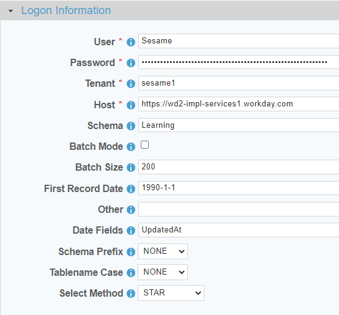

 <a href="http://www.sesamesoftware.com"></img></a>

[comment]: # (Change Heading to reflect Datasource)

#  Workday

[comment]: # (Leave Nav BAR untouched)

[[Installation](../guides/installguide.md)] [[Registration](../guides/RegistrationGuide.md)] [[Configuration](../guides/configurationGuide.md)] [[Datasource](../guides/DatasourceGuide.md)]

---

[comment]: # (Leave Or Alter Required info as needed)

### *Required Information*

* **User**
* **Password**
* **Tenant**
* **Host**
* **Schema**

### Steps

[comment]: # (step 1 is common to all Datasources)
[comment]: # (Step 2.1and 2.2 should be adjusted for Data Source specific)
[comment]: # (Step 3 should be Image of the datasource you can add the screenshot to the images folder or create a placeholder like {image of datasource screen})
[comment]: # (adjust step 4 and below as needed)

1. From the front page of the RJ UI, go to the left hand side and click **Datasources --> New Datasource**
2. On the next screen, choose a label for your Datasource.
   1. Recommended: ‘Source Workday’ or something similar.
   2. Select Workday Template
   3. Click Save
3. 
4. Logon Information Section
   1. User: *Workday User to authenticate with*
   2. Password: *Password for your Workday User*
   3. Tenant: *Workday Tenant to retrieve data from*
   4. Host: *Workday Host (defaults to: https://wd2-impl-services1.workday.com)*
   5. Schema: *Workday Service to retrieve API Objects from (i.e. Learning, Admissions, Payroll etc.)*
5. Click Test
6. Once you see Connection Test Successful, click Save and Close.

---

[[&#9664; Datasource Guide](../guides/DatasourceGuide.md)]

  <a href="http://www.sesamesoftware.com"></img></a> 

