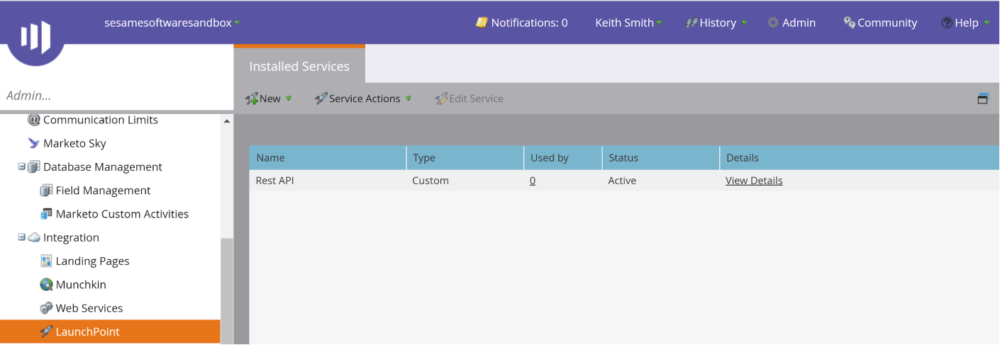

<a href="http://www.sesamesoftware.com"></img></a>

# Credentials for Google Analytics

[[Installation](../installguide.md)] [[Registration](../RegistrationGuide.md)] [[Configuration](../configurationGuide.md)] [[Datasource](../DatasourceGuide.md)]

---
## Obtaining an API Token
1. Login to Google console (https://console.cloud.google.com)
2. Navigate to **API's and services&rarr;Credentials**

2. Click **Create Credentials** 
3. If you click **Get Token**, a new token will be generated.
Input the token into **OAuthAccessToken** property in the Open Authorization Information tab
After creating the access token, a connection can now be made using the values obtained from the previous steps. Specify these connection properties at a minimum to connect:

- **OAuthAccessToken** the Token Id when the access token was created.
- **OAuthClientId** the Consumer Key displayed when the application was created.
- **OAuthClientSecret** the Consumer Secret displayed when the application was created.

---

[[&#9664; Previous](../marketo.md)]

  <a href="http://www.sesamesoftware.com"></img></a> 

