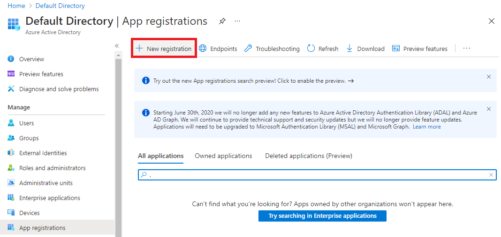
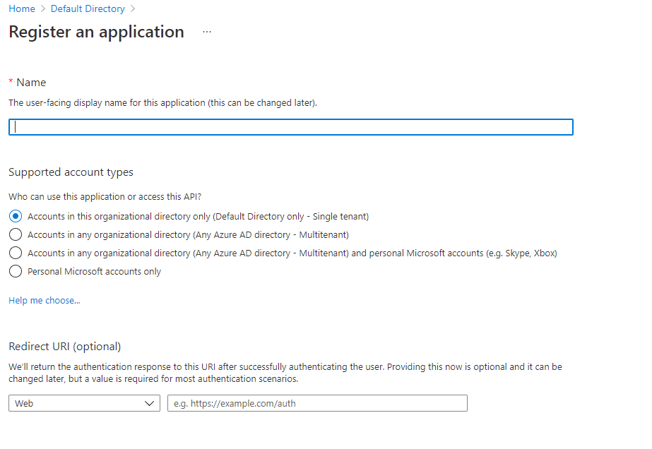
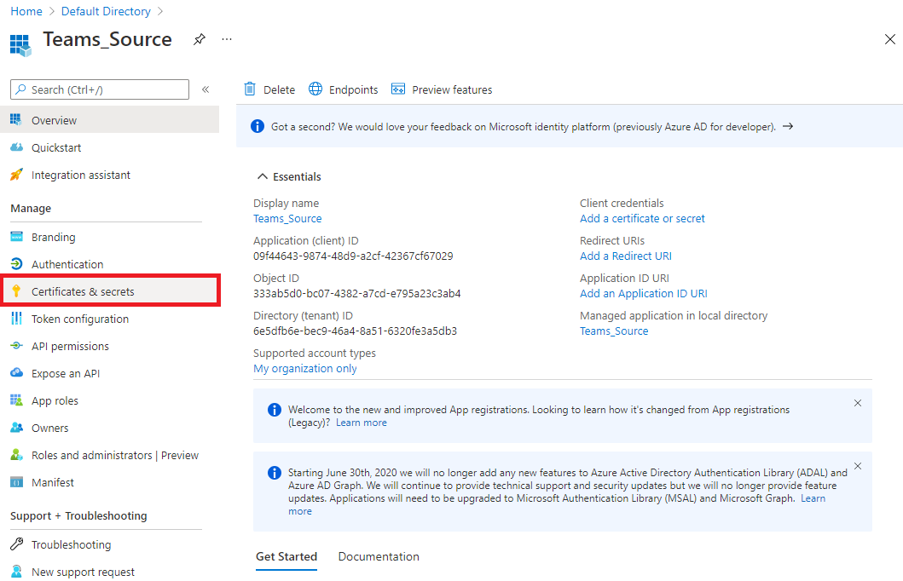
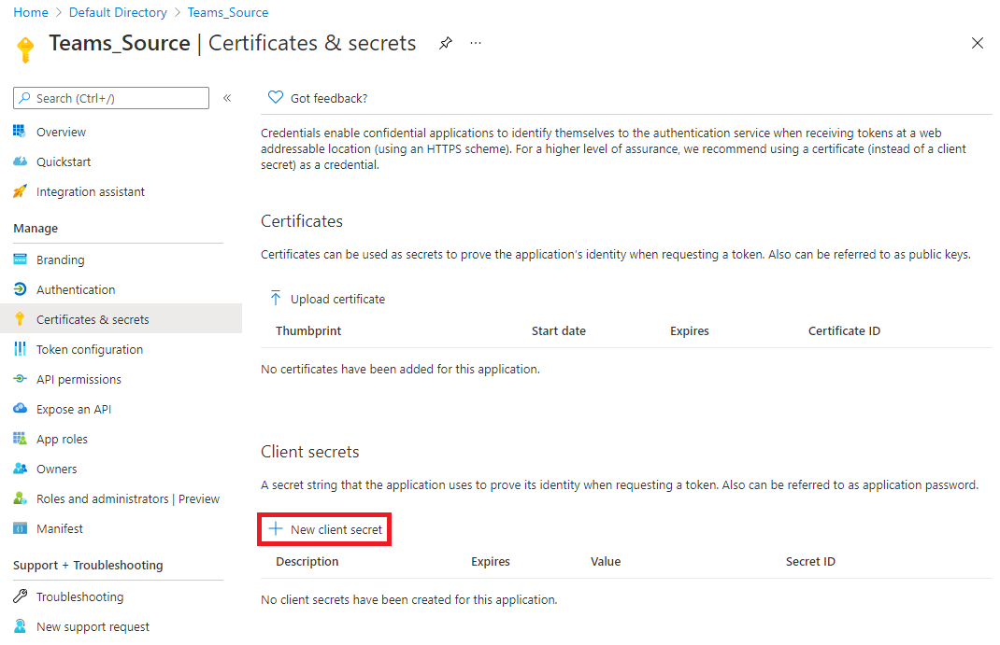

# Credentials for NetSuite

---

1. In the Azure Portal, create a new app registration by navigating to **Azure Active Directory &rarr; App Registrations** and then click **New registration**.

2. On the **Register an application** page, provide your app a name, select the supported account type, and a redirect URI then save your app.

3. Once saved, make note of the Application (client) ID and then click **Certificates & secrets** on the left panel. 

4. Click **New client secret** and add a client secret to your app. Be sure to make note of the secret that was added. 

[Previous](../netsuite.md)