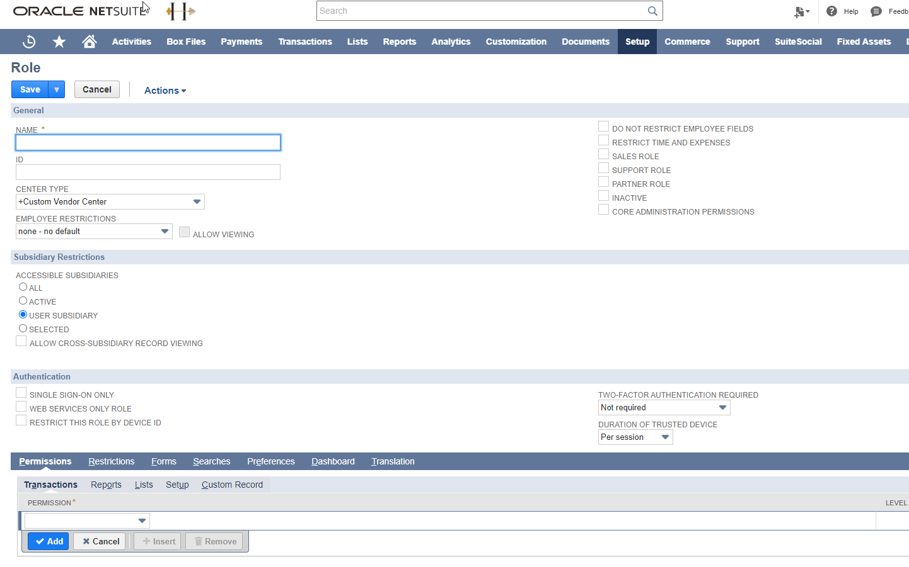
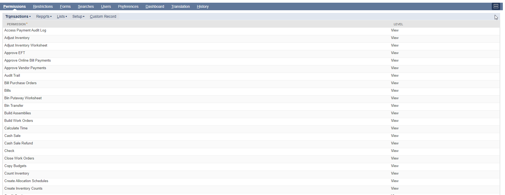

<a href="http://www.sesamesoftware.com"></img></a>

[comment]: # (Change Heading to reflect Datasource)

#  NetSuite Roles and Permissions

[comment]: # (Leave Nav BAR untouched)

[[Installation](../guides/installguide.md)] [[Registration](../guides/RegistrationGuide.md)] [[Configuration](../guides/configurationGuide.md)] [[Datasource](../guides/DatasourceGuide.md)]

---

### Role Creation and Modification in NetSuite

Sesame Software recommends, where it is possible, to modify an existing NetSuite role vs. creation of a role for RJWarehouse use. The process of creating a role from scratch with the many permissions you may or may not need can be a time sink. Using an existing role and verifying/adding permissions required is a quicker way to get your data replication up and running.

With a few exceptions any existing role can be utilized, however the following must be true:
   1. Not an Administrator-Level role.
      1. Note: A user may be an Administrator in addition to a secondary role for RJWarehouse but that secondary role must not be an admin-based role.
   2. Must have been created in the  **Center Type - Classic Center**. 
      1. Note: If the role is anything other than the Classic Center, you must use a different base role as the Center Type is set at role creation and cannot be changed.



#### Role Creation ####

1. Using an Administrator level account, log into NetSuite Instance.
2. Use global search for Manage Roles. 
3. In the dropdown results, click Page: Manage Roles
   1. Click New Role
   2. General Section
      1. NAME (*Recommended Name: ```RJWarehouse Role```*)
      2. ID suggest (*One string, use underscores instead of spaces; Recommended ID: ```rjwarehouse_customrole```*)
      3. CENTER TYPE
         1. REQUIRED - Classic Center
      4. EMPLOYEE RESTRICTIONS
         1. Set to (none - no default)
      5. DO NOT RESTRICT EMPLOYEE FIELDS
         1. Tick box 
      6. Subsidiary Restrictions Section
         1. Accessible Subsidiaries
            1. Click radial button for All
      7. Authentication Section
         1. Verify TWO-FACTOR AUTHENTICATION REQUIRED is set to Not Required.

An existing role must have the Center Type, Employee Restrictions, Subsidiary Restriction and Authentication settings as above. Verify the following options are ***not*** checked: ```CORE ADMINISTRATION PERMISSIONS```, ```SINGLE SIGN-ON ONLY```, ```WEB SERVICES ONLY ROLE``` and ```RESTRICT THIS ROLE BY DEVICE ID```.

Optional but recommended: Re-name the existing role to indicate that it is being utilized by RJWarehouse in addition to its other functions.

Once your role is created or you have your existing role which conforms to the requirements set above, save the role and then add the permissions for the data you need replicated.
#### NetSuite Permissions

Permissions may be configured for a role in NetSuite under **Setup &rarr; Users/Roles &rarr; Mange Roles**. The only permission additions/removals required by RJWarehouse are in the following Required and Access Violation sections. 

All other permissions can be selected as needed however, be aware that in Sesame Software's experience restricting the role too heavily can lead to repeated access/permission violations.  Starting with a high-permission role will speed the process of getting your replication running.
#### Permissions



1. Adding/Removing Permissions
   1. Using an Admin level account, log into the NetSuite instance.
   2. Navigate to Setup &rarr; Users/Roles &rarr; Manage Roles
   3. Find the role you are altering in the list.
   4. Click edit
   5. Find the necessary permission in the Permissions section tabs in the dropdown at the bottom of the page. 
      1. There are 5 tabs of permissions: Transactions, Reports, Lists, Setup, and Custom Record.
   6. Click add. 
      1. If you're adding a lot of permissions, it's recommended to save periodically and navigate back to the role to continue editing.
   7. Repeat steps 5 and 6 for any permissions you need.
   8.  Click save.

Please see this Oracle Document: [NetSuite Users & Roles](https://docs.oracle.com/en/cloud/saas/netsuite/ns-online-help/chapter_N284861.html) for more information on permissions.

Please see this document: [NetSuite Quick Start Permissions Set](NetSuiteBasicPermissionSet.md) for an broad set of permissions that will handle most use cases.

You can find information about removing objects from the RJWarehouse job that you don't have or don't want to grant permission for in the [Warehouse Config](../rjwarehouseconfig.md) and [Select Tables to Load](../../guides/RJWarehouseConfigSelectTables.md) documentation.
#### Required Permissions
Note: Most of the following permissions fall under the Permissions &rarr; Setup section for a role. All permissions from the Required section are necessary for the function of RJWarehouse.

|Permission | Used For|
|---|---|
|Log in Using Access Tokens|	Allows the user to log in to REST / SOAP services with a token.|
|REST Web Services|	All REST requests including when Schema is set to SuiteQL, and support for RESTlets.|
|SOAP Web Services|	All SOAP requests including when Schema is set to SuiteTalk (default), test connection, and some requests for custom fields.|
|Custom <type> Fields (VIEW)|	Allows users to see custom fields of the given type. Used with IncludeCustomFieldColumns.|
|Custom Lists (VIEW)|	Allows displaying metadata for custom list tables. Used with IncludeCustomListTables.|
|Custom Record Types (VIEW)|	Allows displaying metadata for custom record tables. Used with IncludeCustomRecordTables.|
|Customer (VIEW)|	This specific permission is under Permissions &rarr; Lists. It is used for testing the connection in RESTlets.|
|Deleted Records (VIEW)|	Used for retrieving information on deleted records.|
|SuiteAnalytics Workbook (VIEW)|	Found under Permissions -> Reports. Required for SuiteQL access.|
|Other Custom Fields (VIEW)|	Allows users to see custom fields of the "other" type. Used with IncludeCustomFieldColumns.|
|User Access Token|	Allows a user to have tokens created for them via ether Token Based Authentication or Using OAuth Authentication.|

#### Other Permissions

Our Other Permissions section is a compilation of commonly used objects and useful data replications permissions. Please be aware that it is not possible for us to provide an exhaustive list of permissions as NetSuite adds support for new entities and permissions with each version.

Note: Most permissions outside of the Setup tab (Transactions, Reports, Lists) can be set for view-only to limit access if required. If you are receiving permission errors during a run for objects you know you have the permission for, setting to FULL or EDIT can sometimes be the issue.

|Section|Permission|Used For|
|---|---|---|
|Permissions &rarr; Custom Record|	[Custom Record Name]|	Access to the given custom record table|
|Permissions &rarr; Transactions|	[Custom Transaction Name]|	Access to retrieving data from the specific custom transaction via the special Transactions table|
|Permissions &rarr; Lists|	Accounts|	Access to the Account table	|
|Permissions &rarr; Transactions|	Access Payment Audit Log|	Access to the Payment Audit Log|
|Permissions &rarr; Transactions|	Adjust Inventory|	Access to Inventory Adjustments|
|Permissions &rarr; Transactions|	Adjust Inventory|	Access to Inventory Adjustments|
Permissions &rarr; Transactions|	Approve EFT|	Access to approvals of EFT|
|Permissions &rarr; Transactions|	Approve Online Bill Payments|	Access to approvals of Online Bill Payments|
|Permissions &rarr; Transactions|	Approve Vendor Payments|	Access to approvals of Vendor Payments|
|Permissions &rarr; Transactions|	Audit Trail|	Access to audit trails|
|Permissions &rarr; Lists|	Bins|	Access to the Bin table	|
|Permissions &rarr; Transactions|	Build Assemblies|	Access to the AssemblyBuild table	|
|Permissions &rarr; Lists|	Calendar|	Access to the CalendarEvent table along with the Events permission|
|Permissions &rarr; Lists|	Cases|	Access to the SupportCase table	|
|Permissions &rarr; Transactions|	CashSale|	Access to the CashSale table|
|Permissions &rarr; Transactions|	Cash Sale Refund|	Access to the CashRefund table|
|Permissions &rarr; Transactions|	Charge|	Access to the Charge table|
|Permissions &rarr; Transactions|	Check|	Access to the Check table|
|Permissions &rarr; Lists|	Classes|	Access to the Classification table|
|Permissions &rarr; Lists|	Contacts|	Access to the Contact table	|
|Permissions &rarr; Transactions|	Credit Memo|	Access to the CreditMemo table|
|Permissions &rarr; Lists|	Currency|	Access to the Currency table|
|Permissions &rarr; Transactions|	Customer Deposit|	Access to the Customer Deposit table	|
|Permissions &rarr; Transactions|	Customer Payment|	Access to the Customer Payment table	|
|Permissions &rarr; Transactions|  Customer Refund|	Access to the Customer Refund table	|
|Permissions &rarr; Lists|	Departments|	Access to the Department table|
|Permissions &rarr; Transactions|	Deposit|	Access to the Deposit table	|
|Permissions &rarr; Lists|	Documents and Files|	Access to the File and Folder tables|
|Permissions &rarr; Lists|	Employee Record|	Access to the Employee tables|
|Permissions &rarr; Lists|	Events|	Access to the CalendarEvent table along with the Calendars permission|
|Permissions &rarr; Transactions|	Find Transaction|	Access to Transaction search options|
|Permissions &rarr; Transactions|	Fulfill Orders| Access to the ItemFulfillments table|
|Permissions &rarr; Transactions|	Invoice|	Access to the Invoice table|
|Permissions &rarr; Transactions|	Item Receipt|	Access to the ItemReceipt table	|
|Permissions &rarr; Transactions|	Intercompany Adjustments|	Access to Intercompany Journal Entries|
|Permissions &rarr; Lists|	Items|	Access to various Item tables such as DiscountItem, InventoryItem, NonInventoryItem, etc.|
|Permissions &rarr; Lists|	Locations|	Access to the Location table|
|Permissions &rarr; Transactions|	Marketing Campaigns|	Access to Marketing     Campaigns|
|Permissions &rarr; Transactions|	Opportunity|	Access to the Opportunity table|
|Permissions &rarr; Lists|	Phone Calls|Access to the PhoneCall table|
|Permissions &rarr; Lists|	Project Tasks|	Access to the ProjectTask table|
|Permissions &rarr; Transactions|	Purchase Order|	Access to the PurchaseOrder table|
|Permissions &rarr; Transactions|	Sales Order|	Access to the SalesOrder table|
|Permissions &rarr; Lists|	Subsidiaries|	Access to the Subsidiary table|
|Permissions &rarr; Lists|	Tasks|	Access to the Task table|
|Permissions &rarr; Transactions|	Transfer Order|	Access to the TransferOrder table|
|Permissions &rarr; Lists|	Vendors|	Access to the Vendor table|
|Permissions &rarr; Transactions|	Vendor Return Authorization| 	Access to the VendorReturnAuthorization tableTransaction table|
|Permissions &rarr; Transactions|	Work Order|	Access to the WorkOrder table|
#### Permission Access Violations

For the function of RJWarehouse, all of these permissions must be removed from the role.

|Section|Permission|Note|
|---|---|---|
|Permissions &rarr; Setup|Access Token Management|While required during setup of the tokens, this can cause violations and prevent access to NetSuite once role is being used.|
|Permissions &rarr; Setup|	OAuth 2.0 Authorized Applications Management| Possible permission violation.|
|Permissions &rarr; Setup|Core Administration Permissions|This is a Two Factor Authorization trigger which can cause a permission violation. 2FA is being deprecated by NetSuite, however the current ETA for full deprecation is unknown. Removing this permission is best practice.|
|Permissions &rarr; Setup|	Two-Factor Authentication base| 2FA Trigger, see above.|
|Permissions &rarr; Setup|Set Up OpenID Connect (OIDC) Single Sign-on|	 Possible permission violation.|
|Permissions &rarr; Setup|Set Up OpenID Single Sign-on|	 Possible permission violation.|
|Permissions &rarr; Setup|Set Up SAML Single Sign-on|	 Possible permission violation.|
|Permissions &rarr; Setup|Integration Application|2FA Trigger, see above.|
|Permissions &rarr; Setup|Device ID Management|	2FA Trigger, see above.|
|Permissions &rarr; Setup|View Unencrypted Credit Cards|2FA Trigger, see above.|

If you are having issues with permission violations in your runs and you believe you have set your role up correctly, please contact [support](support@sesamesoftware.com) for assistance.

---

[[&#9664; Back to NetSuite Datasource](../netsuite.md)]

<p align="center" >  <a href="http://www.sesamesoftware.com"></img></a> </p>
