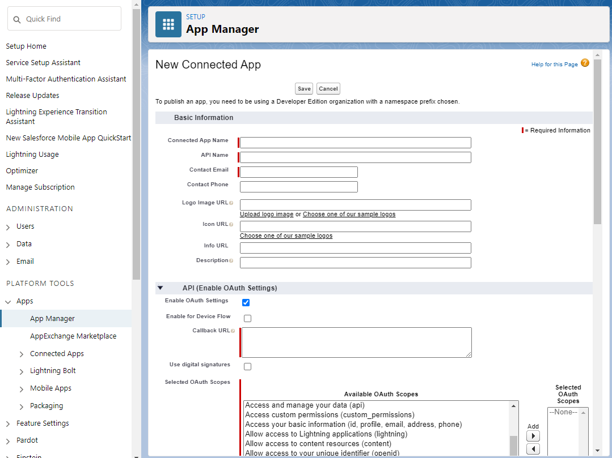
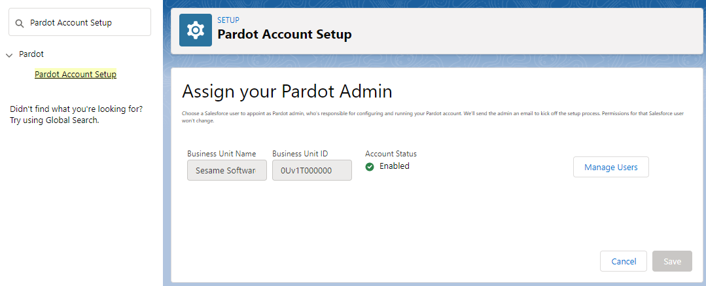

# Credentials for Pardot

---
### To obtain the OAuth Client ID and Client secret:

1. Log in to Salesforce.com.
2. From Setup menu, click on the Apps link located in the Platform Tools section and select the App Manager menu item.
3. Click the New Connected App button in the upper right corner of the App Manager screen.

4. Enter a Connected App Name (to be displayed to users when they log in to grant permissions to your app), an API Name, and a Contact Email address.
5. Click Enable OAuth Settings and enter a value in the Callback URL box.
6. Select the OAuth Scope of permissions that your app should request from the user.

7. Click Save.
8. Click your app name in the list of Connected Apps to open the app credentials page. The OAuth client ID and client secret are now available for display.

### To obtain the Business Unit ID:

To find the Pardot Business Unit ID, use Setup in Salesforce.

1. From Setup, enter "Pardot Account Setup" in the Quick Find box.
2. Click on the Pardot Account Setup link.
3. Your Pardot Business Unit ID begins with "0Uv" and is 18 characters long. If you cannot access the Pardot Account Setup information, ask your Salesforce Administrator to provide you with the Pardot Business Unit ID.

[[Previous](../netsuite.md)]
