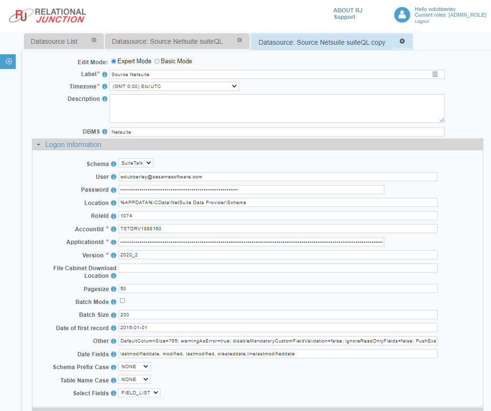
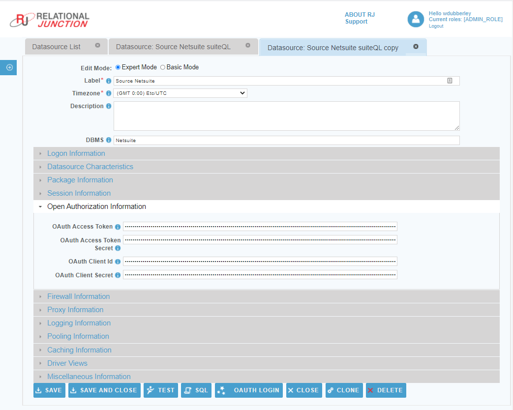
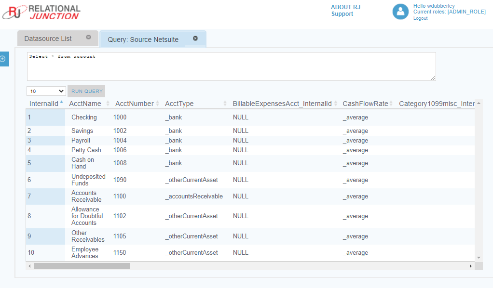

 <a href="http://www.sesamesoftware.com"></img></a>

# NetSuite

[[Installation](../guides/installguide.md)] [[Registration](../guides/RegistrationGuide.md)] [[Configuration](../guides/configurationGuide.md)] [[Datasource](../guides/DatasourceGuide.md)]

---

### *Required Information*

* **RoleID** - The internal ID of the role used by UI login.
* **AccountID** - NetSuite instance Account ID.
* **ApplicationID** - NetSuite Application ID. It is recommended to create one specifically for use by RJWarehouse.
* **Access Tokens** generated by the login, role, and Application ID being used for the RJWarehouse download.

### *Steps*

1. Before you begin, please read and obtain the required connection information from the following documents:
   1. [Netsuite Credentials](additionalinfo/NetsuiteCreds.md)
   2. [Role Creation, Modification and Permissions](additionalinfo/NetSuiteRolesandPermissions.md)
2. From the frontpage of the RJ UI, go to the left hand side and click **Datasources --> New Datasource**
3. On the next screen, choose a label for your Datasource.
   1. Recommended: ```Source NetSuite``` or something similar.
4. Select the Netsuite Template

5. Logon Information Section
   1. RoleID
   2. AccountID

6. Open Authorization Section - Authorization Tokens from NetSuite
   1. Application ID Tokens
      1. OAuthAccessToken
      2. OAuthAccessTokenSecret
   2. Login Tokens
      1. OAuthClientId
      2. OAuthClientSecret
7. Click Test
8. If you see “Connection Test Successful”, click SQL.

   1.  Copy the following into the query window: `select * from account`
   2.  Click Run
   3.  If data is returned, click Save and Close.

---

[[&#9664; Back to Datasources](../datasource.md)]

<p align="center" >  <a href="http://www.sesamesoftware.com"></img></a> </p>
