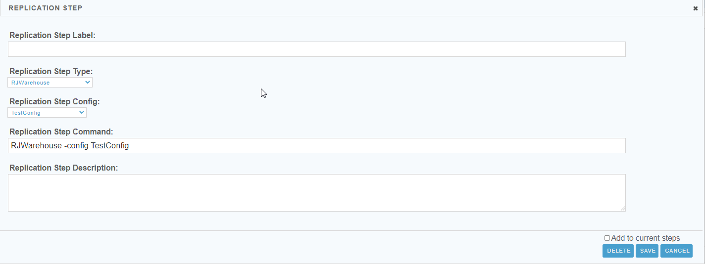

 <a href="http://www.sesamesoftware.com"></img></a>

#  Job Configuration - Setup

[[Installation](installguide.md)] [[Registration](RegistrationGuide.md)] [[Configuration](configurationGuide.md)] [[Datasource](DatasourceGuide.md)]

---

1. From the front page of the RJ UI, go to the menu on the left and click **Jobs &rarr; New Job**
2. The “ETL Job Label” will be the name of the job.
3. Click Save.

#### Details Tab


1. Job Label
   1. The name of the ETL Job as it will appear throughout the Relational Junction ETL application.
2. Schedule Id
   1. This ID is the unique identifier for this job and will be important if you run any ETL jobs through the terminal.
3. Schedule Job
   1. [Schedule Guide](./Supporting/Schedule.md)
4. Global Email Settings
   1.  Use global email settings when sending emails via the system wide settings for Notifications, ETL Job Default Settings, and ETL Job Step Default Settings in the SETUP Configuration section of the left. When toggled off an “Email Account Settings” popup with mail protocol settings for other than other than global emails.
5. Error Notifications To
   1. Email where error logs should be sent if using the Global Email Settings.

#### Job Steps Tab


##### Creating a Job Step

1. Find the Available Replication Steps section.
2. In the dropdown Replication Type select ```RJWarehouse```.
3. In the field Replication Config, select the config you created during the steps in [Warehouse Configuration](rjwarehouseconfig.md).
4. Click Add New button



1. In the Replication Step Label Field, give the step a name.
   1. Name should be meaningful; suggestion: ```getGlobal```
2. In the dropdown Replication Step Type select ```RJWarehouse```.
3. In the dropdown Replication Step Config select the config you created during the steps in [Warehouse Configuration](rjwarehouseconfig.md).
4. The field Replication Step Command should now contain ```RJWarehouse -config [configfromStep8]```
5. At the end of the string in Replication Step Command, hit space and type ```-getGlobal```
6.  Tick Add to current steps box
7.  Click Save or Save and Run
8.  If you clicked Saved and Run, return return to the main Jobs tab to verify the job is running and you can view the log from there.


[[&#9664; Back to Warehouse Config](../rjwarehouseconfig.md)] [[Main &#9654;](../README.md)]


 <p align="center" >  <a href="http://www.sesamesoftware.com"></img></a> </p>
