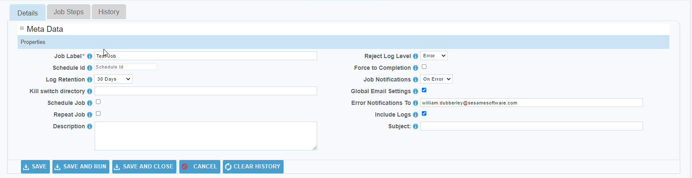
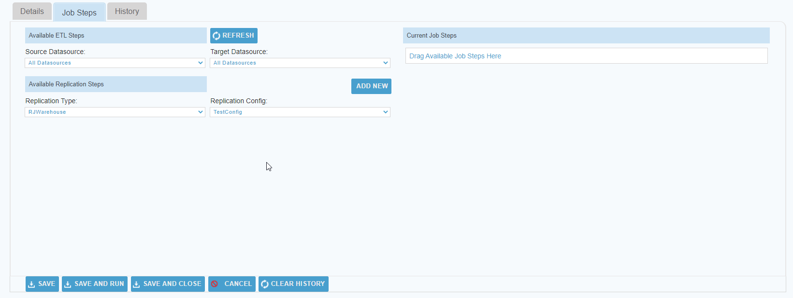
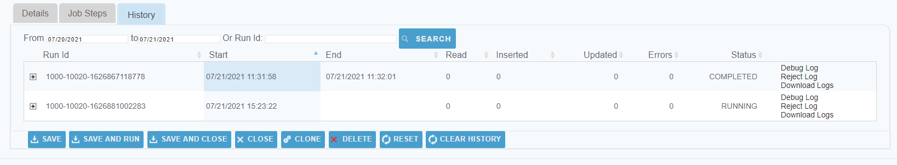

 <a href="http://www.sesamesoftware.com"></img></a>

#  Job Configuration - Setup

[[Installation](installguide.md)] [[Registration](RegistrationGuide.md)] [[Configuration](configurationGuide.md)] [[Datasource](DatasourceGuide.md)]

---

1. From the front page of the RJ UI, go to the menu on the left and click **Jobs &rarr; New Job**
2. The “ETL Job Label” will be the name of the job.
3. Click Save.

#### Details Tab


1. Job Label
   1. The name of the ETL Job as it will appear throughout the Relational Junction ETL application.
2. Schedule Id
   1. This ID is the unique identifier for this job and will be important if you run any ETL jobs through the terminal.
3. Schedule Job
   1. [Schedule Guide](./Supporting/Schedule.md)
4. Global Email Settings
   1.  Use global email settings when sending emails via the system wide settings for Notifications, ETL Job Default Settings, and ETL Job Step Default Settings in the SETUP Configuration section of the left. When toggled off an “Email Account Settings” popup with mail protocol settings for other than other than global emails.
5. Error Notifications To
   1. Email where error logs should be sent if using the Global Email Settings.

#### Job Steps Tab



1. Source Datasource
   1. Select the Source Datasource you created.
2. Target Datasource
   1. Select the Target Datasource you created.
3. Replication Type
   1. Select in drop down RJ Warehouse.
4. Replication Config
   1. Select in dropdown the config you created.
5. Click Add New button
6. Replication Step Label
   1. Give the step a name. 
   2. Suggested: getGlobal
7. Replication Step Type
   1. Select in dropdown RJ Warehouse.
8. Replication Step Config
   1. Select in dropdown config you created.
9. Replication Step Command
   1.  Field should now contain 'RJWarehouse -config [configfromStep8]
   2.  At the end of the string, hit space and type ```-getGlobal```
10. Tick Add to current steps box
11. Click Save or Save and Run
12. If running a job, return to the main Jobs tab to verify the job is running.

#### History Tab



1. Job History Fields
   1. Search
      1. Search using specific date ranges or by run id to see specific log files.
   2. Run Id
      1. The unique run Id that identifies this run
   3. Start
      1. The time the Job started
   4. End
      1. The time the Job ended 
   5. Read
      1. The total number of records read during the run 
   6. Inserted
      1. The total number of records inserted during the run
   7. Updated
      1. The total number of records updated during the run 
   8. Errors
      1. The total number of errors during the run 
   9.  Status
       1.  COMPLETED - Job run completed successfully
       2.  FAILED - Job run failed 
       3.  RUNNING - Current Job that is running
       4.  CANCELED - Job run was canceled 
       5.  CREATED - When the Job was created

NOTE: If your Job is setup to remove logs after X number of days the logs will not be available to download or view

---

 [[&#9664; Create Warehouse Config](rjwarehouseconfig.md)] [[Back to Main &#9654;](../README.md)]

 <p align="center" >  <a href="http://www.sesamesoftware.com"></img></a> </p>
