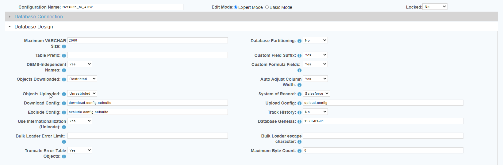

 <a href="http://www.sesamesoftware.com"></img></a>

# Warehouse Configuration - Select Tables to Load

[[Installation](installguide.md)] [[Registration](RegistrationGuide.md)] [[Configuration](configurationGuide.md)] [[Datasource](DatasourceGuide.md)]

---

## Select Tables to Load

Select Tables to Load is a tool that allows you to create/edit download, and exclude files. The download and exclude files are very useful when creating white and black lists for your replication.


#### download.config

The ```download.config``` contains all the objects that will be downloaded and replicated when a RJWarehouse configuration file is set to Restricted.

1. From the front page of the RJ UI, go to the menu on the left and click Warehouse &rarr; Select Tables to Load
2. Choose the configuration for your download.
3. Chose your object list.
   1. If this is your first time, use ```download.config```. If you have a ```download.config``` file you're already using select it in the dropdown.
4. Click the Refresh Available Objects button and wait until the tables load.
   1. On the left are the available objects in your datasource. On the right are the objects in the default ```download.config```.
5. Objects can be moved from Available to Selected and vice versa using the center Add/Remove buttons. ```SHIFT+Click``` and ```CTRL+Click``` can be used to select multiple objects.
6. Click Save
8. In the pop-up give your new ```download.config``` a new suffix. 
   1. Example: ```download.config.netsuite``` or ```download.config.SF2ADW```. 
   2. Be sure it is meaningful and/or note the name down for later reference.
9.  Click Save and close.

#### exclude.config

The ```exclude.config``` contains all the objects to be ignored by the download.

1. From the front page of the RJ UI, go to the menu on the left and click Warehouse &rarr; Select Tables to Load
2. Choose the configuration for your download.
3. Select the  ```exclude.config``` from the Object List.
   1. If this is your first time, use ```exclude.config```. If you have an ```exclude.config``` file you're already using select it.
4. Click the Refresh Available Objects button and wait until the tables load.
   1. On the left are the available objects in your datasource. On the right are the objects in the default ```exclude.config```.
5. Objects can be moved from Available to Selected and vice versa using the center Add/Remove buttons. ```SHIFT+Click``` and ```CTRL+Click``` can be used to select multiple objects.
6. Click Save
8. In the pop-up give your new ```exclude.config``` a new suffix. 
   1. Example: ```exclude.config.netsuite``` or ```exclude.config.SF2ADW```. 
   2. Be sure it is meaningful and/or note the name down for later reference.
9. Click Save.

#### Using the Exclude and Download Configs

To add a ```download.config``` and/or ```exclude.config``` to your current job:



1. From the menu on the left, go to Warehouse &rarr; Config List
2. Select your config file.
3. Verify you are in Expert Mode (radial button at the top of the config) and then click Database Design.
4. Set Objects Downloaded to Restricted
5.  In the Download Config and Exclude Config fields, enter the ```download.config``` and/or ```exclude.config``` you just built.
6.  Click Save and close.

---
[Configuration](guides/configurationGuide.md) | [Notifications](notification.md) | [Datasources](DatasourceGuide.md) | [RJWarehouse Config](rjwarehouseconfig.md) | [Create and Run Job](JobSetup.md)

<p align="center" >  <a href="http://www.sesamesoftware.com"></img></a> </p>