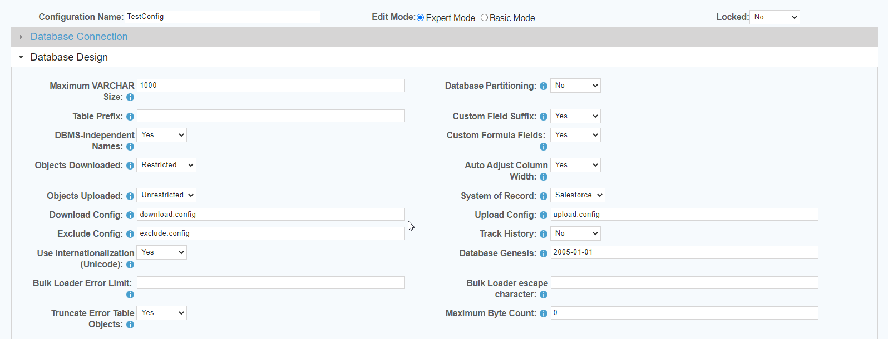

 <a href="http://www.sesamesoftware.com"></img></a>

# Advanced RJ Warehouse Configuration Properties

[[Installation](installguide.md)] [[Registration](RegistrationGuide.md)] [[Configuration](configurationGuide.md)] [[Datasource](DatasourceGuide.md)]

---

At the top of your configuration, select the radial button for Expert Mode.

#### Database Design:

Select Tables to Load
Select tables to load is a tool that allows you to create/edit download, upload, and exclude files. This is most helpful when defining subsets for your use whether for a blacklist or white list. Refer to the database design tab and set objects downloaded to restricted and point to the new subset file i.e. download.config.small.

Restricted | Unrestricted settings for upload and download. Unrestricted is the default setting.
Objects Downloaded
Restricted = Use this option to tightly control which tables are downloaded. The objects must exist in salesforce and the user must have access to the objects. Objects cannot be in both the download and exclude config.
Unrestricted = This option will attempt to download all tables from Salesforce unless they are in the exclude config or default exclude config file. Use this to get started or if you want the system to download all tables automatically. You can create a download config file to define the initial order of the objects in the download and then the rest of the tables will be downloaded in a mostly alphabetical order. Package objects are sometimes presented out of alphabetical order.
You can use the select tables to load tab to define what is in a download or exclude object config file.
Objects Uploaded
Restricted = Use this option to tightly control which tables are uploaded. The objects must exist in salesforce and the user must have access to the objects. Objects need to be in a parent child relational order or else you can get errors like invalid cross reference id. Objects cannot be in both the upload and exclude config.
Unrestricted = This option will attempt to download all tables from Salesforce unless they are in the exclude config or default exclude config file. Use this to get started or if you want the system to download all tables automatically. You can create a download config file to define the initial order of the objects in the download and then the rest of the tables will be downloaded in a mostly alphabetical order. Package objects are sometimes presented out of alphabetical order.
You can use the select tables to load tab to define what is in a download or exclude object config file.

Note: Even if your configuration file is set to restricted mode you can still download or upload a specific object using one of the single object commands.

exclude configs are already populated with some standard objects.  Upon initialization, a checkExcludeGlobal will run creating an exclude.config.default file looking at the current Salesforce object list and verifying which objects are usable or not.  This file will reside in the RJ_HOME\1000\rjwarehouse\conf folder. You can create user specific object config files by using the select tables to load tab.

---

[[&#9664; Create Datasources](DatasourceGuide.md)] [[create and Run Job &#9654;](JobSetup.md)]

  <a href="http://www.sesamesoftware.com"></img></a> 
