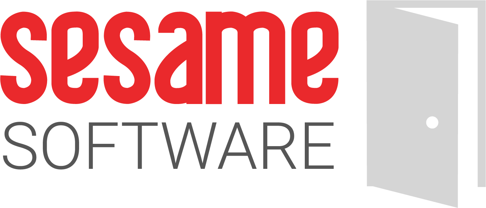

## Relational Junction Product Registration
To get your Registration Code [click here](https://licensemanager.sesamesoftware.com:8443/rjlm/registration/register)

1. Fill out form
   1. All fields are required.
      1. Username and password Can not have special characters.
      2. Password must contain
   2. Save the username and password for Login to Relational Junction
2. clicked the “Register” button
   1. you will recive an email validation.
   2. you will then recive a key in you email that is a series of number sourounded by squar bracket
      1. [21 32 58 ..... 36 98 11]
      2. copy the entire key string including the square brackets. This is your registration key
3. navigate you you installed rj instance http://{public IP Address}:8080/rj
4. Click “Register New Account” 
   1. Paste the emailed key into the field on the “Register New Account” screen.
   2. Once you click the Save button, you will be automatially taken to  the login page
5. Use the Username and Password saved in step 1.2

If you do not receive the email within 5 minutes, please contact support
Support: +1 (408) 550-7999  |  support@sesamesoftware.com
