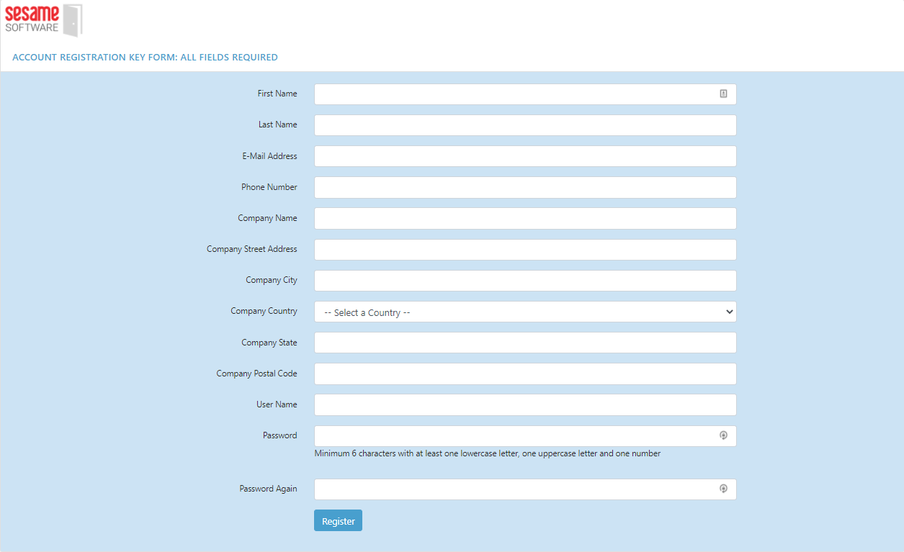

## Relational Junction Product Registration

---

To get your Registration Code [click here](https://licensemanager.sesamesoftware.com:8443/rjlm/registration/register)

1. Fill out Registration Form. All fields required.
   * Username and password can not have special characters.
   * Password must contain Capital Letter, Special Character and a Number. 
2. Save the username and password for login to Relational Junction
3. Click the "Register" button.
   1. You will receive an email with the Registration Key.
      * Key will be series of numbers surrounded by square bracket.
      * [21 32 58 ..... 36 98 11]
4. Copy entire key string including the square brackets.
5. Navigate to your installed RJ instance: `http://{public IP Address}:8080/rj`
6. Click “Register New Account”
   1. Paste the emailed key into the field on the “Register New Account” screen.
7. Once you click the Save button, you will be automatically taken to  the login page
8. Login using the username and password from Step 1.

If you do not receive an email within 5 minutes, please contact technical support at +1 (408) 550-7999  |  support@sesamesoftware.com

[Configuration Guide](../guides/configurationGuide.md)

