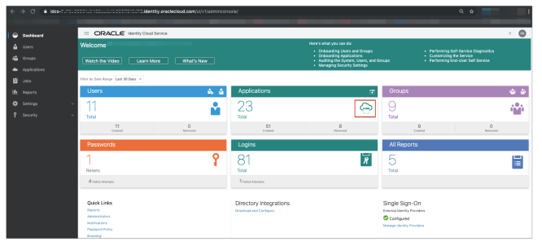
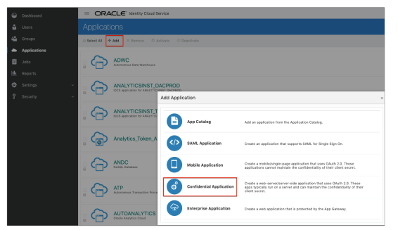
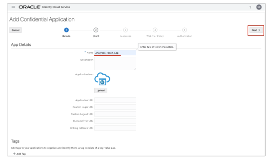
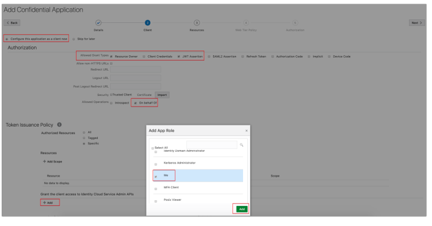
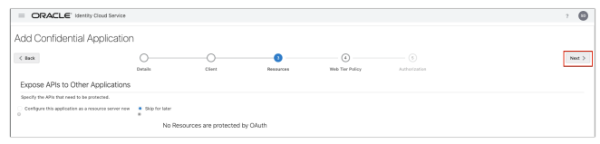
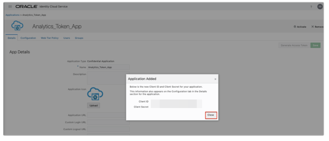
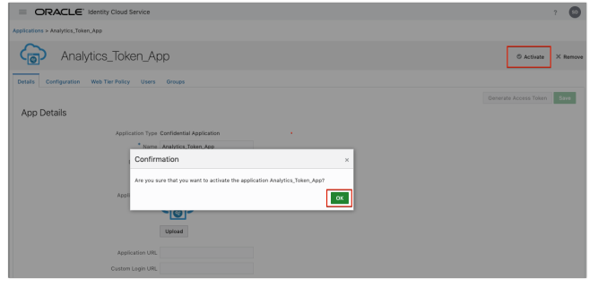
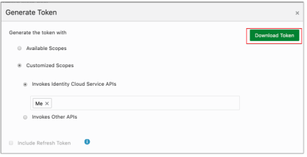

Get Login URL from **&#9776; &rarr; Identity & Security &rarr; Federation &rarr; OracleIdentityCloudService &rarr; Oracle Identity Cloud Service Console**

`https://<idcs-url>/ui/v1/adminconsole`

Navigate to "Applications" tab



 Click "Add" button and Choose "Confidential Application"

Enter a name e.g.: "Analytics_Token_App", Click Next

Click "Configure this application as a client

* Select allowed grant types:
  * Resource Owner
  * Client Credentials
  * JWT Assertion
* In "Allowed Operations", select
  * On behalf Of
* In "Grant the client access to Identity Cloud Service Admin APIs"
  * click "Add"
  * select "Me"



click add agin then next



click next


Click Finish


Copy and save the Client IDand Client SecretStep



Activate the applicationStep



Generate Access Token


Click on Download Token



A token file will be generated with name as “tokens.tok”

Extract Token from tokens.tok File

Open tokens.tok file. it will look something like

```json
{"access_token":"eyJ4NXQjUzI1NiI6Imt5bk1iQ ... ... ... 0jxcCw5oR0ajaNw"}
```

extract the value from the Key access_token. This is what you will need to create an OAC instance
