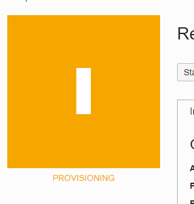
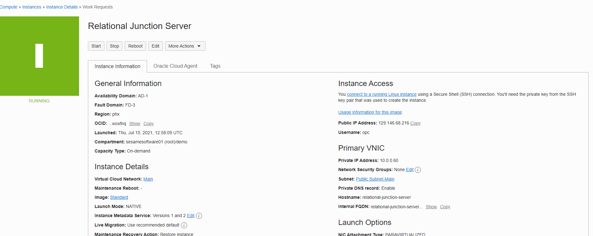

 <a href="http://www.sesamesoftware.com"></img></a> <h1 align="center"> Oracle MarketPlace </h1>

[[Installation](installguide.md)] [[Registration](RegistrationGuide.md)] [[Configuration](configurationGuide.md)] [[Datasource](DatasourceGuide.md)]

---

While the Server is being provisioned

* This would to add the ingress rule to the vcn
* You will need to add port 8080 to you ingress rules

Once it is running

* Copy the public IP address
* In a txt file create a URL with the following pattern `http://{ip address}:8080/rj`
  * Replace {IP address} with the public IP address

---
 [[marketplace install](installWithMarketPlace.md)] [[Upgrade &#9654;](upgrade.md)]
