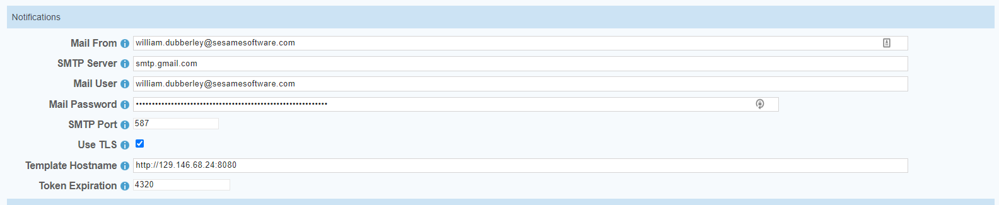
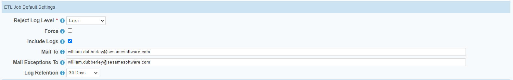

# Relational Junction Configuration Guide

---

## Relational Junction Global Settings

Use these instructions to set up email notifications if desired. This Step is optional so can be skipped and done later

[[Back to Install](../guides/configurationGuide.md)]
[Back to Main](../README.md)
