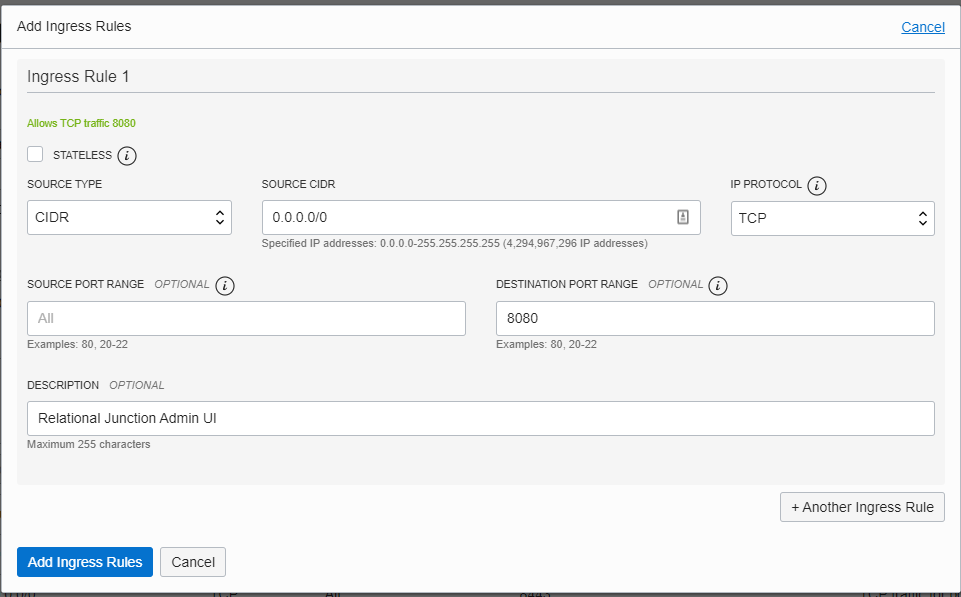

 <a href="http://www.sesamesoftware.com"></img></a>

# Configuring the Stack Variables

[[Installation](installguide.md)] [[Registration](RegistrationGuide.md)] [[Configuration](configurationGuide.md)] [[Datasource](DatasourceGuide.md)]

---

- [Configuring the Stack Variables](#configuring-the-stack-variables)
  - [Options](#options)
    - [Relational Junction Configuration](#relational-junction-configuration)
    - [Virtual Cloud Network Configuration Existing](#virtual-cloud-network-configuration-existing)
    - [Virtual Cloud Network Configuration New](#virtual-cloud-network-configuration-new)
    - [Other Options](#other-options)

## Options

### Relational Junction Configuration

1. Verify Compartment
   1. Defaults to Relational Junction but you can change the name if required.
2. Select Shape
   1. VM.Standard2.4 (*Default*)
   2. VM.Standard2.8
   3. VM.Standard2.16
   4. VM.Standard2.24
3. Choose License Type
   1. Relational Junction Standard (*Default - up to 4 Junctions*)
   2. Relational Junction Enterprise (*Unlimited Junctions*)
4. Upload your Public SSH Key
   1. If you need assistance creating one, please see this article:  [OCI Prerequisites](Supporting/OCI-Prerequisites.md##setup-keys)
5. Chose Availability Domain. Values are 1-3.

### Virtual Cloud Network Configuration Existing

1. Check - Use Existing VCN
2. Select the compartment of the existing VCN
3. Select existing VCN
4. Select Private and Public Subnets

When using an existing VCN you will need to add port 8080 to you ingress rules

### Virtual Cloud Network Configuration New

Make any changes to the defaults required, such as names and/or CIDR blocks.

### Other Options
* [Autonomous Data Warehouse Configuration](Supporting/ADW.md)
* [Autonomous Transaction Processing Configuration](Supporting/ATP.md)
* [Autonomous JSON Database Configuration](Supporting/AJD.md)
* [Database Systems Configuration](Supporting/dbas.md)
* [Oracle Analytics Cloud Configuration](Supporting/OAC.md)
* [Object Storage Configuration](Supporting/OBS.md)

---

[[&#9664; Create Stack](installwithORM.md)] [[Review and Apply &#9654;](reviewAndApply.md)]

  <a href="http://www.sesamesoftware.com"></img></a> 

