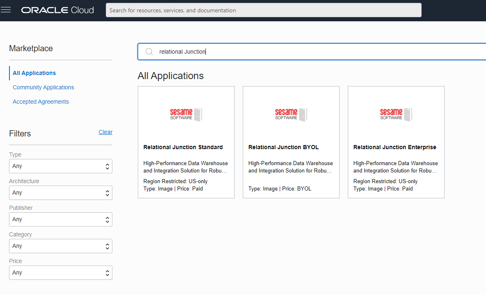
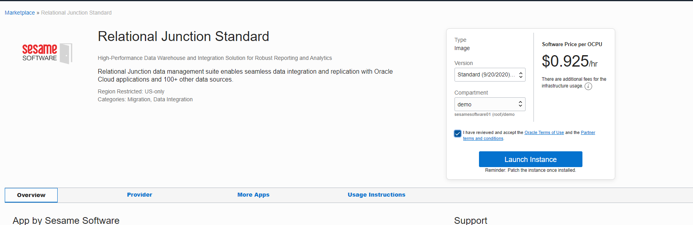
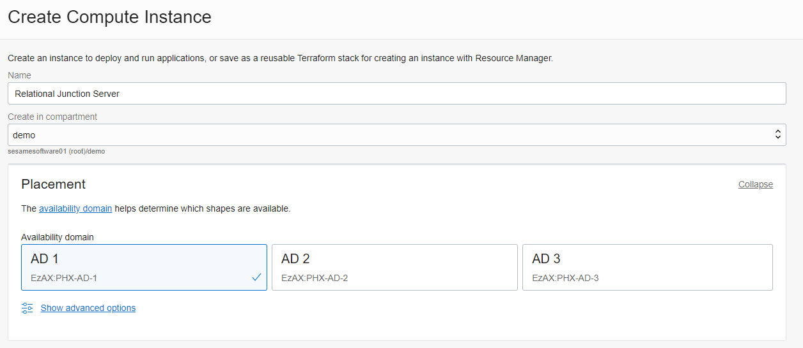
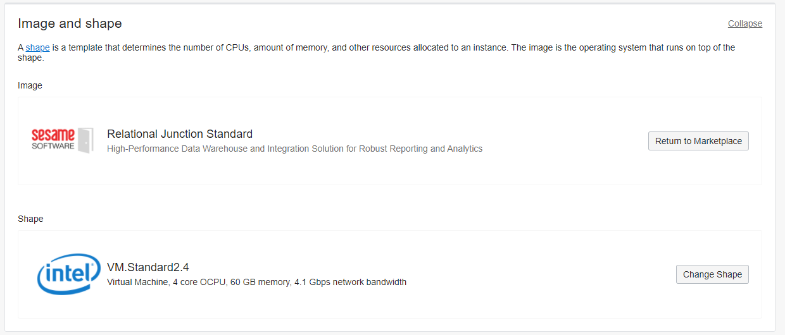
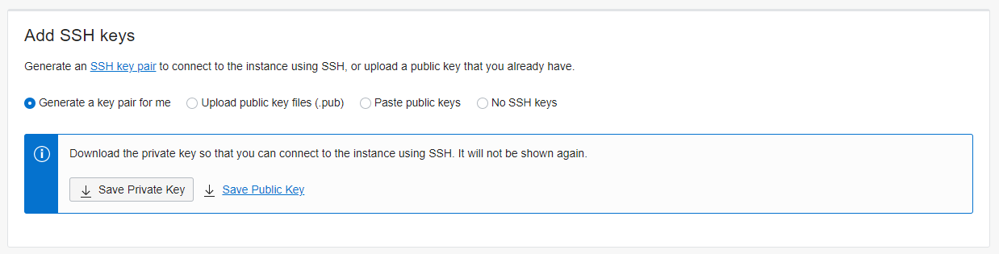
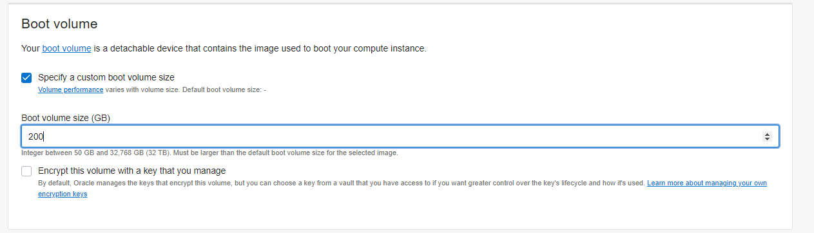

 <a href="http://www.sesamesoftware.com"></img></a> <h1 align="center"> Oracle MarketPlace </h1>

[[Installation](installguide.md)] [[Registration](RegistrationGuide.md)] [[Configuration](configurationGuide.md)] [[Datasource](DatasourceGuide.md)]

---

There are two ways to start installing from the market place

* License Type depends on the number of Junctions you will need (MS SQLServer, ADW, CSV, JSON, NetSuite, Salesforce, etc.) Standard is 4 and under, Enterprise is 5 and above.

You can find Relational Junction from the following links:

* [Standard License](https://cloudmarketplace.oracle.com/marketplace/en_US/listing/63628618)
* [Enterprise License](https://cloudmarketplace.oracle.com/marketplace/en_US/listing/84537680)

Or you can also to go thorough the console to the marketplace:
**&#9776; &rarr; Marketplace &rarr; All Applications**

Search for `Relational Junction` and choose the appropriate license type.

This will open up the acceptance dialog in this example we will be using the standard version. 

* Select Compartment you wish the install in
* Accept Terms of usage
* Launce

Once you launch it will bring up the create compute screen.

* Create a meaningful name
* Verify the compartment
* Choose which availability domain you want to use

* Verify image is correct.
* Minimum shape is a 2.4 you can increase this here but most use cases are met in a 2.4 shape.

* Choose your VCN
* Choose your Subnet

* You will need to generate and save keys to local system our use existing keys.

* Specify boot volume size min recommendation is 200 gb

Click Create.

---

[[&#9664; Installation](installguide.md)] [[Upgrade &#9654;](upgrade.md)]

  <a href="http://www.sesamesoftware.com"></img></a> 

