# Install with Oracle Resource Manager

[](installguide.md)[](RegistrationGuide.md)[](configurationGuide.md)[](../Datasources/README.md)

---

## Getting Started

First step is to download The ORM compressed file [here](../release/RelationalJunctionOCIStack.zip)

### Creating the Stack

1. login to your oci tenancy
2. click &#9776; &rarr; Developer Services &rarr; Resource Manager &rarr; Stacks
3. 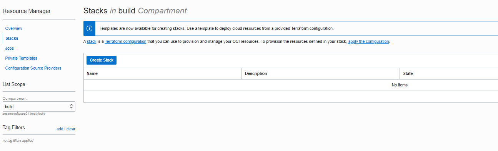
   1. Set the compartment you whish to build in
   2. click Create Stack
4. 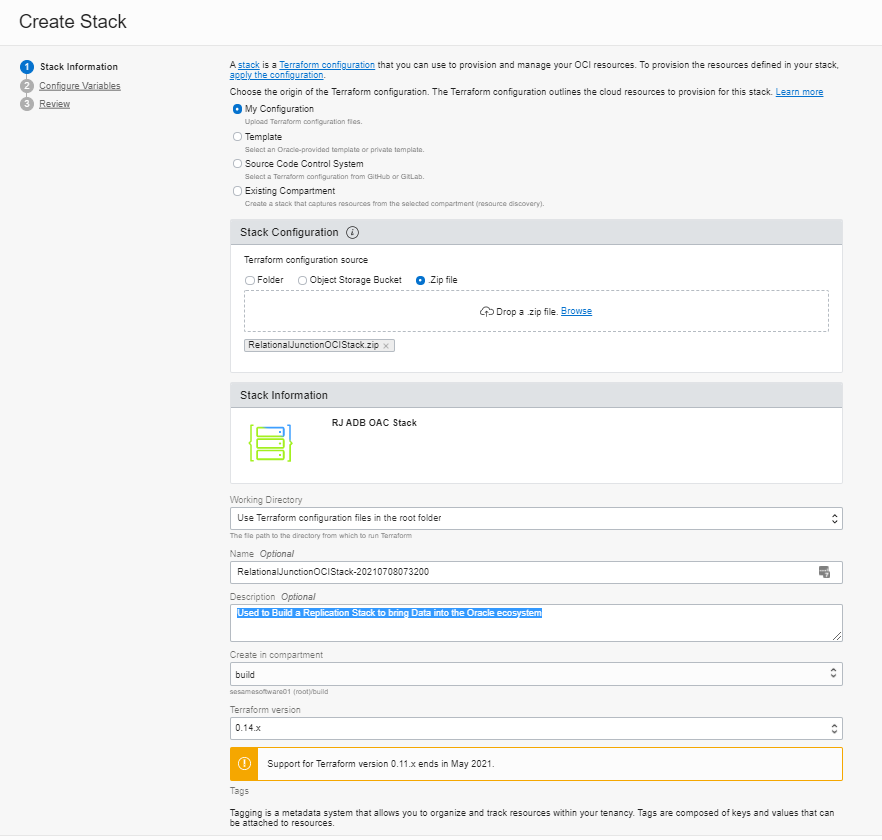
   1. select My Configuration
   2. Select .zip File
   3. Browse to the download location of RelationalJunctionOCIStack.zip
   4. click ok
5. You can optionally change the name
6. change compartment to create the stack in
7. and add tags
8. clickNext

### Configuring the Stack Variables

#### The options

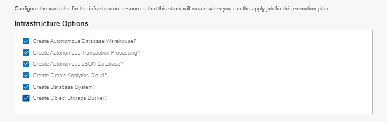

#### Relational Junction Configuration

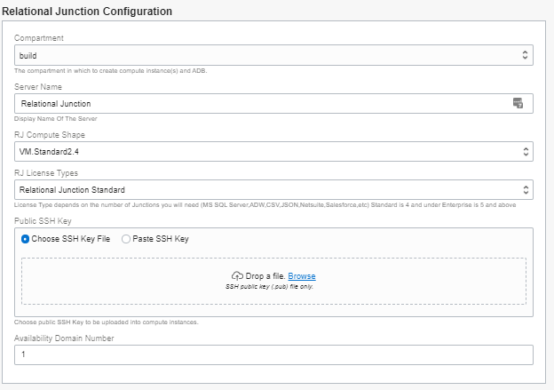

1. verify compartment
2. you can optionally set server name
3. select shape
   1. VM.Standard2.4 *default*
   2. VM.Standard2.8
   3. VM.Standard2.16
   4. VM.Standard2.24
4. you can choose License Type
   1. Relational Junction Standard *default*
   2. Relational Junction Enterprise
   3. Relational Junction BYOL
5. upload you public ssh key
6. you can create one following these [directions](Supporting/OCI-Prerequisites.md##setup-keys)
7. Chose Availability Domain. values are 1-3

#### Virtual Cloud Network Configuration Existing

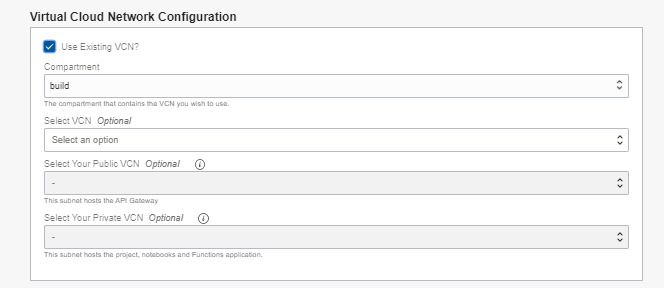

1. check Use existing VCN
2. Choose Compartment of existing VCN
3. Select VCN
4. Select Private and Public Subnets

#### Virtual Cloud Network Configuration New

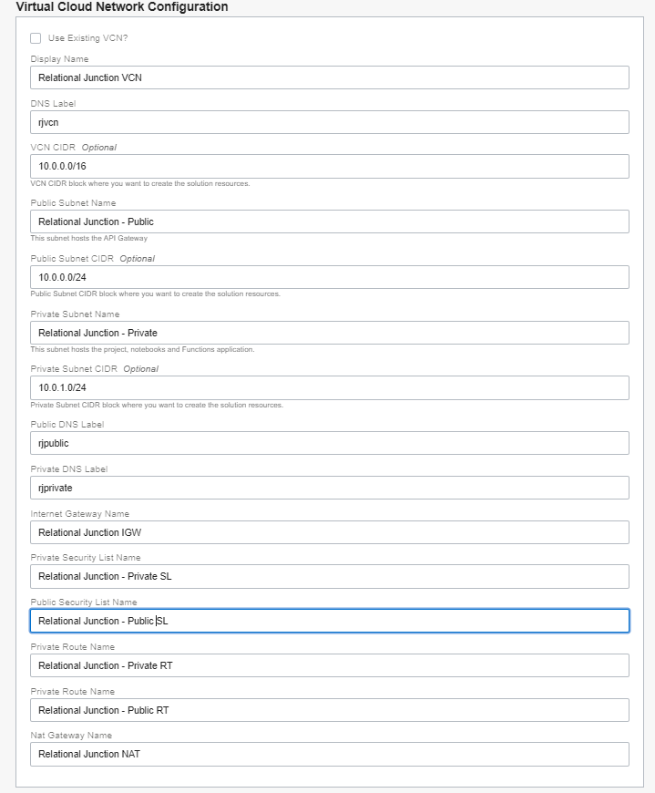

Make any changes to the defaults  such as names and or cider blocks

#### Autonomous Database Warehouse Configuration

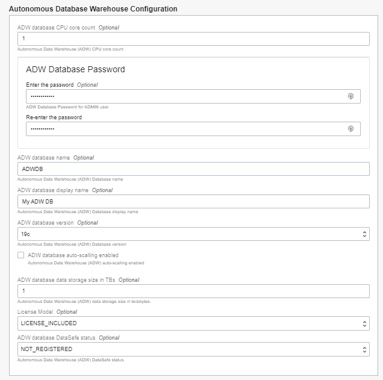

* Password is required
  * Min length 12
  * 2 Uppercase
  * 2 Lowercase
  * 2 Special
* other value changes are optional
  
#### Autonomous Transaction Processing Configuration

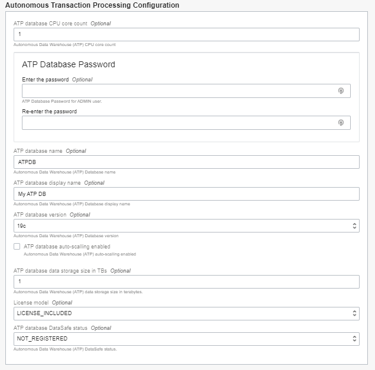

* Password is required
  * Min length 12
  * 2 Uppercase
  * 2 Lowercase
  * 2 Special
* other value changes are optional
  
#### Autonomous JSON Database Configuration

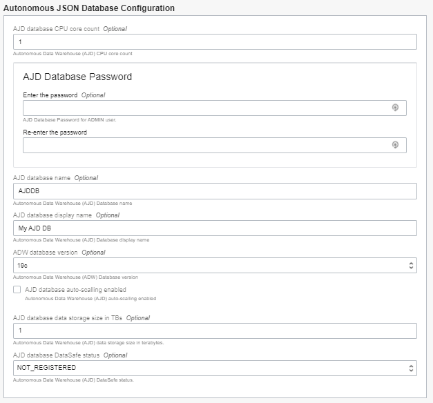

* Password is required
  * Min length 12
  * 2 Uppercase
  * 2 Lowercase
  * 2 Special
* other value changes are optional
  
#### Database Systems Configuration

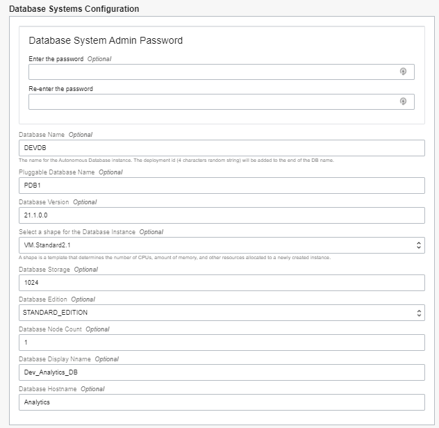

* Password is required
  * Min length 12
  * 2 Uppercase
  * 2 Lowercase
  * 2 Special
* other value changes are optional
  
#### Object Storage Configuration

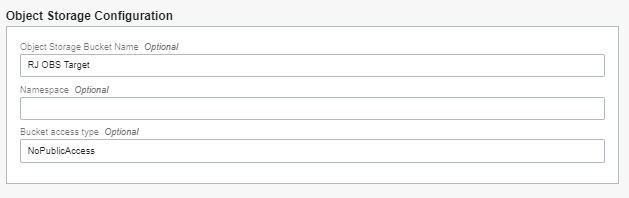

1. Bucket name
2. Namespace Can be found &#9776; &rarr; Governance & Administration &rarr; TenancyDetails &rarr; Object Storage namespace

#### Oracle Analytics Cloud Configuration

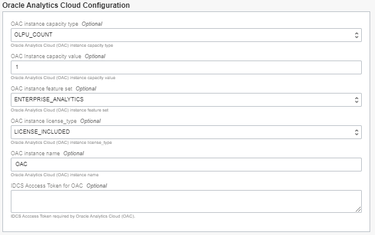

1. set instance name
2. insert IDCS Token
   1. [click here](Supporting/idcsToken.md) for instruction on generating an IDCS token

### Reviewing

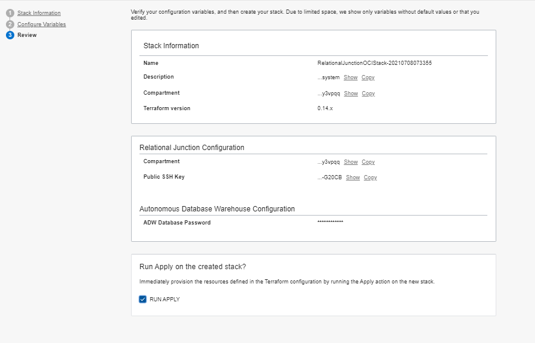

### upgrading to Latest version

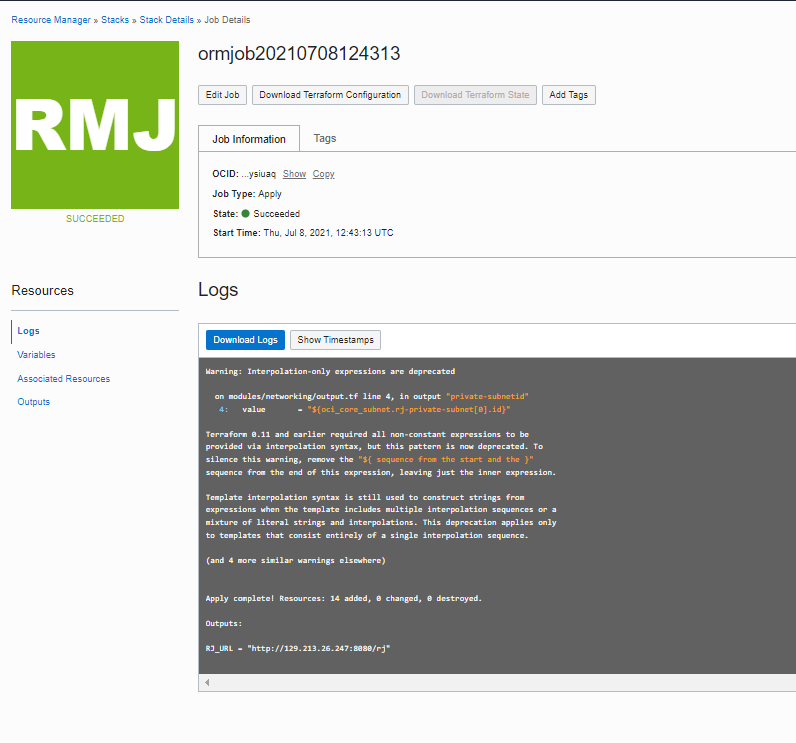

once the apply is successful make note of the RJ_URL under outputs should look something like `RJ_URL = "http://129.213.26.247:8080/rj"`

next you will need to go to the command line and run the following
ssh -i {path to privatekey} opc@{ip address from RJ_URL} upgrade This will bring you  install up to the latest available GA code
for example

```bash
ssh -i ~/.ssh/oci opc@129.213.26.247 upgrade
```

once this is complete open a browser tab and navigate to the URL provided in the RJ_URL output.

**Next step** [registration](RegistrationGuide.md)
