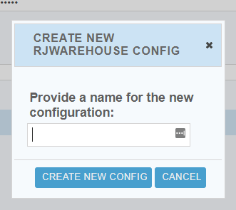
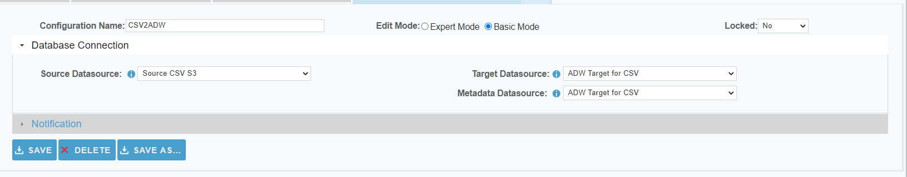

 <a href="http://www.sesamesoftware.com"></img></a>

# Warehouse Configuration

[[Installation](installguide.md)] [[Registration](RegistrationGuide.md)] [[Configuration](configurationGuide.md)] [[Datasource](DatasourceGuide.md)]

---

From the front page of the RJ UI, go to the menu on the left and click **Warehouse &rarr; New Config**

1. Provide a name for the new configuration
   1. The name should be meaningful
   2. Cannot contain spaces.
2. Click Create New Config

1. Database Connection Section
   1. Source Datasource
      * The datasource you created for your Source.
   2. Target Datasource
      * The datasource you created for your Target.
   3. Metadata Datasource
      * Same as Target unless indicated otherwise.
2. Click Save
3. Close tab.
   
These instructions are for an unrestricted run to download all discoverable objects in a datasource. For a limited ist of objects i.e., creating a Restricted job and more configuration properties, please see: [Advanced Configuration Properties](../images/databaseConnection.png)

---

[[&#9664; Create Datasources](DatasourceGuide.md)] [[create and Run Job &#9654;](JobSetup.md)]

  <a href="http://www.sesamesoftware.com"></img></a> 

